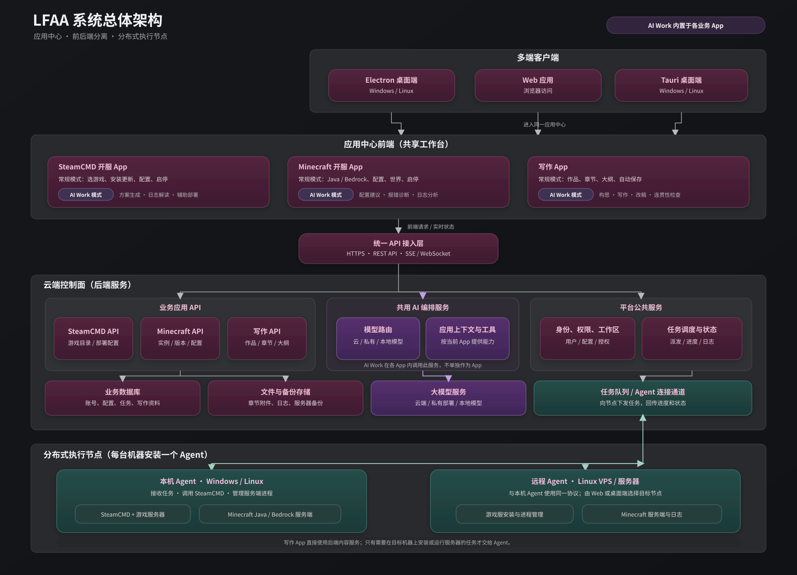
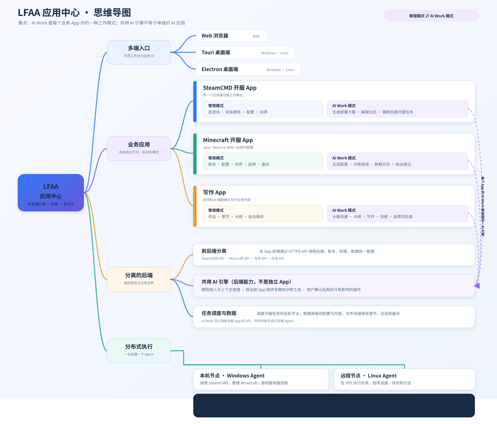

# LFAA 系统总体架构

## 1. 项目目标

LFAA 是以聊天与语音为入口的通用 AI 智能体工作台，支持项目开发、文件理解与修改、应用操作及外部 Agent 协作。用户提出目标，模型驱动主 Agent 与子 Agent 选择工具、执行和验证。SteamCMD、Minecraft 与写作是首批业务 App；通用任务工作区 `/tasks` 是不依赖这些业务分类的任务入口。

### LFAA-Harness 产品身份与平台路线

LFAA-Harness 是 LFAA 自有的完整 Harness 产品，参考 DeepSeek-Harness 的纯净项目形态，并维护自己的运行时（Runtime）、配置档与能力组合（Profile/Bundle）、插件生命周期及业务能力。LFAA 可以通过锁文件复用其正式发布的库，但用户不应为运行 LFAA 另行安装 DSH 应用，也不应把 LFAA 描述成只能加载在 DSH 中的插件。除必要启动底座外，用户可用的基础能力应由登记并随项目交付的 LFAA 第一方插件/能力包提供；外部另行安装的插件作为用户运行数据管理，不随源码包或桌面安装包携带。

**“万物皆插件”是 LFAA-Harness 的架构硬原则。** 除启动、插件装配、生命周期调度、权限隔离等不可缺少的最小 Harness 内核外，所有可用能力都必须作为 LFAA 第一方插件或能力包登记、组合和运行，覆盖身份、设置、存储、模型、智能体、工具、应用服务、客户端接入及守护进程执行能力。内核只负责加载、协调、隔离和管理插件，不另藏一套绕开插件体系的业务实现；每个插件仍调用其唯一业务与数据责任归属，服从既有认证、授权、设置和节点执行边界。纯内部库可以作为插件的实现依赖，但不能借此把可用产品能力移出插件登记与生命周期管理。

桌面产品的目标是 Windows/macOS Electron；Android 与 Linux 是后续平台目标。当前代码状态与目标尚有差距：根 `build:desktop:win` 仍调用 Tauri Windows 打包脚本，Electron 独立打包入口当前只有 Windows x64，未发现 macOS Electron 安装/签名验收入口；Linux 桌面及 Android Host/安装包未实现。以上现状作为迁移待办，不能覆盖新的产品目标，也不能写成平台已支持。

所有源码归档和安装包必须从受版本控制的 LFAA 第一方源码、锁定的产品运行依赖和内置插件组合生成，不得收集开发盘的外部插件、账户凭据、Provider 密钥、游戏实例、数据库、缓存、日志或本机路径。新安装首次启动使用空白用户数据。只读检查打包暂存清单不等同于安装包归档验收；须在干净克隆中构建，检查最终包内容，并安装到开发盘以外的位置验证首次启动。

**LFAA Harness 的核心是大模型驱动全部 App 和节点能力。** 用户提出目标，主 Agent 调用用户配置的顶尖模型理解和规划，自主选择工具、加载 Skills、调用领域提示词和专家、委派子 Agent；各 Agent 根据真实结果继续判断、调整计划并完成交付。所有已接入的应用服务与节点操作都通过这条能力链接入，常规界面复用相同业务服务。包、装配与生命周期为这条执行链提供基础。

模型选择使用设置中心的 Provider、已激活模型及 Agent 配置，不写死模型品牌或版本，不静默降级。专家是具有领域提示词、Skills 和工具范围的 Agent；子 Agent 协作通过任务、上下文和结果合同追踪。程序负责工具登记、协议、授权、持久化、执行与回报，业务行动由模型决定。未经实现和登记的能力不能作为模型可用工具宣称；当前实现与目标差距在下文和开发计划分别列明。

模型思考参数只采用已配置 Provider 的模型目录明确返回的能力元数据。控制端保留模型目录来源、支持档位与官方默认值，设置中心和 AI Work 共用同一账户 `reasoning_mode` 及选项映射；`default` 表示请求不发送思考参数，按 Provider 自身默认行为处理，不代表“无”或“关闭”。目录没有返回可验证能力时隐藏可调档位，运行时不根据品牌或模型名称猜测；`aiRuntime.speed` 仍是输出长度策略，与模型思考力度分开保存。

应用决定自己的二级导航、工作台和业务流程；“常规”和“AI Work”是应用内交互模式，不是独立业务应用。全局导航在应用间保持稳定：左一（最窄全局导航轨）在应用工作区提供“应用中心”直达入口，启动或切换 App 均先经应用中心选择；应用工作区路由 `/apps/<app>/<mode>/...` 与通用任务 `/tasks` 必须带有当前应用中心入口的导航状态，直接加载或浏览器历史恢复时没有匹配状态则回到 `/`。该前端路由状态只管理入口体验，不替代 Server 的认证和授权。通用任务默认偏好仅在应用中心标记入口，不自动绕过应用中心；跨 App 快捷键和会话恢复也先回应用中心。左一房子返回当前应用与当前选中模式的首页，并清除该模式下的子页面路径。左二只承载当前 App 的二级业务导航和写作作品目录，不显示不可直跳的其他应用列表。进入 Minecraft 后左二切换为 Minecraft 菜单；Minecraft 常规模式根页显示总览，AI Work 根页显示对话入口。设置和文件页面复用左一，但不显示该应用中心快捷按钮：设置房子返回进入设置前保存的精确路由；文件管理房子返回来源 App/模式首页并清除子页面路径，从设置进入文件管理时沿用设置页保存的来源 App/模式，来源没有 App 路由时回退当前选中 App/模式。应用中心仍可从导航轨更多入口直达 `/`；文件列表工具栏的小房子只返回 `LFAA 数据`目录根。设置中心按 App 管理存储位置：SteamCMD 工具和 Steam 游戏文件使用独立目录，Minecraft 实例使用节点数据根目录内可配置的实例根目录；写作作品数据、资料目录、专职角色、作品 Skills 和业务 Tools 归控制端账户 SQLite 与 Writing/Controller/Core Tools Owner，模型目录读取受当前账户与当前作品校验约束。写作 AI Work 可由 Agent 按自然语言目标为当前作品大纲或选中章节创建待审提案；AI 不提供应用工具，用户必须在审阅界面比较原文和新稿并明确点击应用。提案绑定账户/作品/目标与基准正文摘要，应用前以事务重验；成功应用保留旧文至现有修订历史，冲突、拒绝、过期和被替代提案都不覆盖作品。作品资料目录与启用的作品 Skill 由当前作品限定的只读 Tool 按需读取，用户内容是不可信资料且不构成授权。专职角色只调整代码内置的写作方法，不能改变权限、工具集合或目标范围。逐项审批和权限模式不改变显式应用边界；P4 长短篇拆解、修订分析和文风比较使用现有 Agent Loop 与有界只读工具；P5 常规模式以认证 ZIP 流提供 DeepWrite 长篇导出、短篇/剧本导入，映射回同一账户 SQLite Owner 并创建新作品，不支持同步或覆盖。浏览器文件选择/下载与 DeepWrite 客户端互操作仍须实测。Steam 游戏部署 Runner 与写作其他业务仍按各自范围接入。

AI Work 已接入通用任务、后台 Agent Run、工具协议持久化、独立执行的子 Agent、项目文件工具、可执行插件工具与 HTTP MCP 发现/调用。主 Agent 可通过通用 `lfaa_ask_user` 工具向用户提出结构化澄清，暂停当前 Run，接收选项、自由输入或跳过后继续同一轮工具循环；问题事件按当前用户、run 和 questionId 校验并保存在当前会话活动与消息中。刷新或关闭网页只撤销事件订阅，任务继续运行；服务端重启后把未完成任务标为中断，不自动重放写操作。项目文件工具经报告 `project-files-v1` 的 Daemon 读取设置中心任务文件夹，执行真实目录浏览、文本检索、分页读取、文件创建、摘要与唯一锚点替换及 Git 差异；可发现项目 `.agents/skills` 与 `.lfaa/skills` 内的 SKILL.md，再由模型按需读取。Minecraft、SteamCMD 与写作工具复用既有业务服务；通用任务可以选择已接入的游戏能力，写作编辑仍绑定当前账户的作品上下文。主机 Shell 由在线 Daemon 以其 OS 账户权限执行。节点任务输出面板展示真实状态、退出码和结果，按账户隔离；交互式 PTY 尚未接入。Agent 面向用户的最终回复默认以自然语言转述工具证据，不直接粘贴内部 JSON、协议字段或状态枚举；用户明确需要代码、命令、日志或原始 JSON 时再准确提供。AI Work 消息下方的工作轨迹默认收起，摘要显示真实当前阶段和耗时，展开后按事件顺序呈现具体操作、阶段、说明与持久化耗时；活动名称和等待/结果状态来自现有 Agent Loop 与 Session 记录，不显示隐藏推理文本、审批参数 JSON 或原始工具结果。Windows 桌面 Profile 的电脑操控工具由 LFAA 自有 `lfaa-computer-use` 包在本机 Control Plane 内调用 Cua Driver TypeScript SDK，账户开关默认关闭；设置页只管理模型工具授权，不探测或执行桌面操作，模型按当前任务自行决定是否调用；鼠标与键盘输入沿用现有 dangerous 工具权限审批，截图仅作为本轮 Provider 图像输入且不会以图像字节写入会话。

本机控制与远程节点共用执行器合同：Windows `lfaa web` 自动托管本地 Daemon，可用 `--no-local-daemon` 改为独立节点部署；远程节点经独立凭据绑定身份并通过 HTTPS 连接。手动和模型共用 Minecraft 重启、控制台指令与实例操作互斥。命令输出在运行中回传，取消须等节点确认进程退出；过期租约不复活、不重放，停止聊天与已产生的副作用分开记录。通用命令是节点 OS 账户的原生执行，不宣称具备 OS 沙盒。实现文件、设置项与实际验证范围见 [执行控制合同](execution-control.md)。

设置中心提供子 Agent 模型账户、数量/深度上限和每个 Agent 的模型/工具调用预算；空子模型账户继承主模型，指定账户不可用时明确失败。子任务在独立会话执行、共享任务树委派预算和写操作拒绝状态，只能使用父任务允许的工具。当前按模型工具调用顺序执行委派，尚无并行子 Agent 调度。插件工具必须登记真实解析、权限与执行实现，卸载撤销执行资格。MCP 使用用户保存的服务地址发现真实工具，外部只读声明不构成授权；所有 MCP 执行沿用高风险权限合同，完全权限不逐项审批。当前仅支持无内建认证的 Streamable HTTP 工具服务，OAuth、stdio、客户端采样与外部 ChatGPT 双向接管尚未接入。浏览器操作仍须连接实际提供这些工具的服务。Windows `desktop` Profile 已装配本机电脑操控驱动，Web 与远程 Daemon 不装配；代码和替身回归不代表真实桌面、真实 Provider 或打包桌面验收完成。

语音输入与完成回复播报使用宿主 Web Speech API，由设置中心开关及常规语言控制；识别文字先进入输入框，由用户发送。不支持的宿主明确显示不可用；尚未接入模型 Realtime API、连续语音中断和原生桌面语音驱动。实际麦克风、真实 Provider 和真实第三方 MCP 联调状态见 [本轮交付记录](harness-agent-delivery.md)。

Minecraft 常规模式使用本机 Windows x64 Daemon 的多核心原生执行路径：FastMirror 16 类核心及 Mohist Youer 共 17 类目录、版本和构建来自真实来源。传统面板一次提交后由领域服务原子登记任务，节点准备匹配的 Java/PHP、校验下载、安装、配置并等待真实就绪。默认核心为账户配置（初始推荐 Paper），默认执行为 native，进程具有目标 OS 账户权限，不宣称 OS 沙盒。显式 AppContainer 继续限定旧 Vanilla 支持路径并 fail closed。Java 管理复用现有环境或安装校验的官方 Temurin JRE，同主版本无 JRE 时回退 JDK；下载预算来自设置中心，安装位于节点数据根。离开页面不停止实例；当前状态来自节点真实观测。实机矩阵、上游构建失败和未测量边界见 [Minecraft 开发记录](minecraft-deployment-plan.md)。

```text
用户的一句话
   ↓
主 Agent ↔ LLM：理解、推理、规划和选择行动
   ├─ 直接调用工具
   └─ 按需委派给专业子 Agent
             ↓
     工具调用后端业务服务
             ↓ 需要操作主机时
        server 派发节点任务
             ↓
     daemon 执行并回传进度/结果
             ↓
主 Agent 检查任务结果并向用户完成交付
```

LLM 是推理能力来源；Agent Runtime 组织模型调用、上下文、任务循环、工具执行和委派。Tools 是受控能力接口。daemon 是分布式节点上的执行程序，不是 LLM Agent。

## 2. 总体架构图





## 3. 组件与部署边界

| 组件 | 主要职责 | 部署位置 |
|---|---|---|
| `apps/web` | Web 平台入口；连接部署在本机或远程主机上的控制端 | Web 主机或静态站点 |
| `apps/desktop-electron` | LFAA-Harness Windows/macOS 桌面主线；通过 Electron 展示共用前端并启动本机控制端和 Daemon | 目标为 Windows/macOS；当前仅登记 Windows x64 安装包入口 |
| `apps/desktop-tauri` | 现存 Windows x64 桌面实现及打包脚本；与已确认的 Electron 主线不一致，待路线迁移后再决定保留范围 | 当前实现，不作为新的正式桌面目标 |
| `packages/client/*` | Web 与桌面共用的 UI，各 `ui-*` 包登记界面能力 | 随 Web 或桌面外壳打包 |
| `apps/cli` 与控制端职责包 | API、权限、业务服务、Agent Loop、任务调度和节点登记 | 中心服务器或本机 |
| `apps/daemon`、`packages/host/daemon` 与 `native/system` | 独立节点执行进程；桌面安装包内置本机 Daemon，远程主机可单独接入；Rust Sandbox Host 执行 Windows AppContainer/Job Object 边界 | 本机及 Windows x64 远程节点连接已接入；远程主机安装器和系统服务托管未接入 |
| `data` | 控制面持久化数据和本机节点数据的开发默认目录 | 持久化磁盘或 Docker Volume |

Windows Electron 桌面安装包作为一个产品交付，随包包含共享 Web、Control Plane、本机 Daemon Profile 和 Windows Sandbox Host。Electron 主进程启动 Control Plane 后，以独立子进程启动 Daemon；关闭桌面应用时分别收尾本机服务。用户正常启动桌面软件即可使用本机节点，无需手动构建或启动 Daemon。远程节点沿用独立 HTTPS 身份和认证任务通道，由控制端签发连接、目标主机导入后运行 Daemon；当前远程运行入口面向 Windows x64，未接入自动安装器或系统服务注册。

现存 Windows Tauri 实现通过系统 WebView2 展示共享前端，并随 NSIS Setup 安装控制端、Node.js 运行时、本机 Daemon 和 Windows Sandbox Host；控制端只监听 `localhost`，生产前端、REST API 和 Socket.IO 使用同一 Origin。首次默认把持久数据放在用户选择的安装目录下 `data/`；安装位置不可写时回退到 `%APPDATA%\lfaa-desktop-electron\data`。桌面端数据目录配置沿用 `%APPDATA%\lfaa-desktop-electron\storage.json`，管理员可在设置中心选择其他绝对路径，完整重启时复制并核对数据，旧目录保留。未来的内网穿透由可单独管理的隧道进程转发本机 Web/API/Socket.IO，当前尚未实现。这描述的是现存 Tauri 实现，不构成新的桌面产品目标。

前端 CSS 按样式所有权分层：`packages/client/ui-theme/src/tokens.css` 是全局设计变量来源，`base.css` 负责文档级基础样式，`common.css` 只维护跨多个独立组件共用的状态样式，`responsive.css` 维护跨页面断点；页面和组件专属规则仍留在 `styles/` 页面样式或组件同名样式文件中。全局样式由 `packages/client/web/src/main.tsx` 按级联顺序导入一次；组件专属 CSS 由对应组件文件导入。

源码按 `packages/<领域>/<包名>` 组织，浏览器、控制端与节点是运行位置和安全边界，不再对应旧的三块源码根目录。Daemon 是节点常驻执行进程：注册身份和实际能力、发送心跳、经认证领取任务、执行文件/进程/应用操作、回传真实输出与状态。模型与主 Agent 通过工具决定目标和任务；节点不自行改写业务意图。

当前产品源码已迁入 `packages/*/*`。`apps/web`、`apps/cli` 和 `apps/daemon` 提供启动工具。真实运行数据使用现有目录和数据库迁移链；已经确认的临时测试数据按开发规范清理，不保留空的旧源码目录。

### LFAA Harness 包工作区与装配

以 [DeepSeek Harness 仓库](https://github.com/deepseek-ai/deepseek-harness) 的 `639ed015397290b3745d163aafe02ffee4aa3f84` 为本次目录基准。上游 316 个两级包目录均已保留原名；完整路径、对应包名和实现状态见 [目录对标清单](harness-packages.md)。Minecraft、SteamCMD、Writing、账户认证和节点执行等 LFAA 专属能力按已有业务名称增加包。

```text
packages/
├─ boot/app-boot/             共享启动器，Cordis Context 与 Loader
├─ bundle/{base,web-app,daemon-app}/     package.json + cordis.patch.yml
├─ client/
│  ├─ web/                   浏览器启动
│  ├─ modules/               可撤销的懒加载模块登记
│  ├─ connection/            API、Socket.IO 与现有前端类型
│  ├─ ui-renderer/            React 挂载与账户路由
│  ├─ ui-layout/              工作台与主题设置映射
│  ├─ ui-chat/                AI Work 聊天
│  ├─ ui-commands/            快捷键匹配
│  ├─ ui-settings/            设置中心页面
│  ├─ ui-settings-{account,general,models}/
│  ├─ ui-shortcuts/           快捷键配置控件
│  ├─ ui-sidebar-files/       文件管理
│  ├─ ui-{minecraft,writing}/ LFAA 应用界面
│  └─ …                      其余上游同名包目录，状态明确列出
├─ api/                      Gateway 与独立控制器插件
├─ core/{agent,agent-default-model,agent-loop,agent-tool-presentation,scope,session,system-prompt,tools}/
├─ settings/settings/        服务端设置与应用偏好
├─ typert/{protocol,registry,loader,generator}/ 类型化 Remote 协议与插件贡献链
├─ storage/storage-sqlite/   原数据库与完整迁移链
├─ host/{webserver,daemon}/  HTTP 和节点进程插件
├─ games/{minecraft,steamcmd}/
├─ document/writing/         写作业务与提示词
└─ …                        保留全部上游包分类
```

- **包边界：** 各实现包独立声明 `dependencies`、公开导出和构建命令，包名遵循现有 `lfaa-*` 约定。跨包导入使用公开的 `包名/src/*`；TypeScript、Vite、开发 Node 和生产 Node 使用同一包映射。
- **Profile 和 Bundle：** 沿用上游角色。Profile 是命名配置，`lfaa.profile.bundles` 选择组合包；Bundle 是普通 workspace 包，其 `lfaa.bundle.patch` 指向 `cordis.patch.yml`。没有额外创造 Profile 或 Plugin 源码分类。内置配置位于 `apps/cli/config/profiles/{web,desktop,daemon}`。
- **装配顺序：** Bundle 列表顺序 → Profile 补丁 → 可选 Harness Home 补丁 → 各 `--patch`。补丁支持按 ID 插入和覆盖插件行；必需行不能被普通覆盖停用或更换实现。配置读取不创建或重置用户设置。
- **生命周期：** 控制端所有服务、AI 扩展和 HTTP 共用一个 Context。API 控制器登记子 Router，插件卸载时撤销对应路由层；HTTP/Socket、SQLite 和事件由所属 Fiber 清理。Daemon 使用独立进程、独立 Context 和 `daemon` Profile，保留任务与执行边界。桌面两个既有外壳调用相同编译入口，继续管理本机进程。
- **类型化 Remote（P0 进行中）：** `typert/protocol` 定义一元方法、逐方法授权器、调用上下文、错误码和 4 MiB 总量上限的有界 JSON；工程期 `typert/generator` 已从账户 `auth/me` TypeScript 源合同生成双端方法描述与 JSON Schema，并由 Host 校验器和 Client Connection 实际消费。`registry` 与 `loader` 在基础 Bundle 提供本地登记、调用校验和 Fiber 卸载撤销。其余 API/Socket 尚未迁移；流协议与生成工件自动发现未完成，不能据此声称 Typert 全量接入。
- **浏览器：** LFAA 内置 UI 继续由 `client/modules` 按既有本地模块映射懒加载。Wallpaper Engine 官方来源中经逐次 commit 核验且符合 DSH v1/Host/Client 适配合同的版本接入 Host/Client；模块只在登录后装载，并在注销时撤销。`ui-renderer` 根声明 DSH Settings、右侧栏和 shell overlay Slots；设置页、`ApplicationWorkspace` 与 `Workbench` 分别消费对应 Slot。右侧 `guide` 图标由现有 `SidebarRightRuntime` 激活并展开工作台上下文栏，shell overlay 仅在有该上下文栏的 App Workbench 路由挂载，使插件 RopeDock 复用 LFAA 主题容器。LFAA Session 内核由现有 `lfaa-session` 唯一持有，事件与 AI Work/Agent Loop 共用受控 JSONL 存储，SQLite 只保留权限索引投影；此内核不映射给 DSH Renderer。挂载 DSH Renderer 前仍只提供稳定的“无 DSH Session”投影以支持根级插件 Slots；显式 DSH Session target 和依赖 `SessionProvider` 的会话扩展保持不支持。Wallpaper Engine 当前的 Settings 与右侧栏入口是根级 Slots，不依赖 DSH Session。`shortcuts.register`、`locale`、`theme` 分别映射到账户快捷键、`general.language` 与 `appearance.theme` Owner，受控颜色/字体角色作用域为 Workbench 内的 Markdown、代码块和节点终端。任意其他 DSH 插件仍不会进入页面主 Realm。Host 通过现有 Express/WebServer 注入启动图并提供版本化 `/plugins` 资源，认证事件通道 `/plugins/events` 与插件管理 API 共用同一 carrier，不另起通用服务。固定官方 Wallpaper Engine Host 的 Scene/网页壁纸文件统一复用现有 LFAA HTTP/WebServer 认证路由 `/wallpaper-engine/scene-files/`，运行副本禁用上游媒体 origin，不能启动第二个监听端口；资源仍经上游 token、字面路径和 realpath 围栏。Scene Renderer 复用同源 `/wallpaper-engine/scene-live/` iframe 路由，固定来源适配器只对 `index.html` 文档响应将 `X-Frame-Options` 覆盖为 `SAMEORIGIN`，其他应用响应继续使用 WebServer 的 `DENY` 策略。Web 入口声明根 `<base>`，保证深层 SPA 路由下相对资源仍指向 Host 根路径。
- **设置与数据：** 设置控件、类型、默认值、校验、持久化及主题映射继续是现有合同。SQLite 版本链、`LFAA_DATA_DIR`、凭据、实例相对路径和三种权限模式保持原实现。清理范围仅包含确认的测试残留和废弃源码，真实用户数据及正式备份保留。
- **节点入口：** `lfaa-host-daemon/daemon` 是公开执行插件入口，源码为 `packages/host/daemon/src/daemon.mjs`，由 `daemon-app` 装配；同包根入口提供控制端节点登记服务。两入口分别加载，不把数据库服务导入节点执行进程。桌面包内置并托管本机 Daemon；`lfaa daemon` 可在独立主机运行同一节点 Profile，远程身份由控制端签发并通过 HTTPS 认证。节点版本读取包清单，卸载时取消心跳、领取请求及轮询等待，停止受管 Minecraft 实例并释放自身锁。已执行中的其他任务继续使用原完成/故障回报协议，尚未承诺所有任务均可中途取消。
- **测试隔离：** `packages/test-support` 与 `apps/cli/tests` 为长期测试资源，不装配到产品，也不进入控制端/节点发布运行树。默认能力包构建排除测试支持；可以显式单独构建测试包。
- **占位合同：** 尚未实现的上游目录仅用 `.gitkeep` 保留位置，没有 `package.json`，不能被装配或出现在可用能力清单中。与 DSH 互操作时优先依赖官方发布包，不把仅保留目录的占位项标为支持功能。
- **构建：** 能力包进入根 `dist/packages/<领域>/<包名>`；Web、控制端、Daemon 和桌面入口分别进入 `dist/apps/web`、`dist/apps/control-plane`、`dist/apps/daemon`、`dist/apps/desktop-electron`、`dist/apps/desktop-tauri`。`build:windows-sandbox-host` 只生成 Windows 原生 Sandbox Host；Electron 桌面发行脚本会自动构建并把它与本机 Daemon 运行树一起装入单个安装包。桌面依赖部署和临时组装进入 `dist/.tmp/<入口>`，各入口只清理自己的输出子目录。

### Web 运行树与桌面安装包

根目录菜单 `3` 的 `pnpm run build` 构建 Harness 包、Web、Control Plane 与 CLI 运行树，不生成桌面安装程序。Windows Electron 桌面发行入口 `pnpm run build:desktop:electron:win` 会构建 Web、Control Plane、Windows Sandbox Host，再生成单一 NSIS 安装包；安装包内同时包含桌面壳、本机控制端和 Daemon。普通桌面启动自动管理本机 Daemon，管理员只在新增远程节点时才需要单独配置目标主机的连接。

## 4. AI 服务设计

AI 能力分布于 `core/agent`、`agent-default-model`、`agent-loop`、`agent-tool-presentation`、`scope`、`session`、`system-prompt`、`tools`、`interaction/permission-presets`、`hooks/hook-protocol`、`preset/agent-preset`、`skill` 与 `document/writing` 等职责包。模型密钥只进入控制端运行时。

- **Core 适配：** `core/scope` 只按当前 App 和子 Agent 工具允许集收窄模型可见能力，真实授权仍由 API、权限预设和工具 Owner 执行；`agent-default-model` 委托设置中心解析活动或显式模型账户；`agent-tool-presentation` 仅把已登记工具转换为 Provider 原生 function schema；`system-prompt` 固定组合安全/回复要求、权限、App 领域指引、扩展与运行上下文。Session 与 Agent Loop 继续由既有 JSONL、Settings、API 和领域 Owner 管理。LFAA 当前未接入 PTC 隔离执行器，因此不提供 PTC 或混合工具呈现。

- **LLM 接入**：管理模型提供方、模型选择、流式响应、超时和用量信息。模型密钥仅保存在后端安全配置中。
- **主 Agent**：维护任务上下文，调用 LLM 推理，形成步骤计划，选择工具，跟踪任务和停止条件，并汇总可验证的结果。
- **子 Agent**：模型按明确子任务调用委派工具，创建独立会话和执行循环；模型账户、委派数量及深度读取设置中心，工具范围不超过父任务。真实状态与活动证据返回父任务，取消会传播；目前顺序委派，尚无并行调度。
- **Skills**：封装领域知识和可复用流程，供 Agent 在适用时加载；不代替业务代码执行高权限操作。
- **Prompts**：定义 Agent 角色、输出要求和约束，按公共能力或业务领域维护。
- **领域提示词接入**：Writing 的 14 个任务模板由 packages/document/writing/src/writing-prompt-library.ts 定义，通过 writing_load_prompt 只读按需加载；Minecraft 的总控与专项模板由 packages/games/minecraft/src/minecraft-prompt-library.ts 定义，minecraftSystemInstruction 常驻加载 Minecraft 总控并列出专项模板，再由仅属于 Minecraft App 的 minecraft_load_prompt 只读加载。目录里的来源文档按现有业务、Agent、Daemon 与安全能力改写；模板不注册新功能、不扩大授权，未接入的批量生文、生图、Minecraft 核心或恢复操作仍明确未接入。
- **Tools**：向模型描述可执行能力。Minecraft、SteamCMD、项目文件、写作和主机 Shell 工具按当前 LFAA 应用/账户上下文提供；账户可在设置中心为已配置 MCP 服务选择可用 App。通用能力安装器还能检查用户提供的 Streamable HTTP MCP 地址，核对并固定真实工具清单，将其保存到当前账户 MCP 设置；安装成功后，Agent Loop 只把该地址的已核对工具加入同一 Agent Run 的下一次模型请求。之后的连接仍受 `plugins.enabled`、服务启用状态、`applicationIds`、当前权限模式和工具范围控制，工具清单漂移时 fail closed。模型根据工具 schema 自主选择调用，未采用关键词路由。三种项目权限模式统一决定是否等待逐项审批，完全权限下模型可自主决定并执行所有项目操控，包括任意 Shell 与任意路径。Shell 命令经 server 任务队列派发给在线 Daemon，以该 Daemon 的 OS 账户运行，回传真实输出与退出状态；不在 server 进程直接执行命令。
- **用户 Markdown 知识库**：`packages/knowledge/knowledge-library` 是账户隔离的 SQLite Owner，支持知识、用户 Skills、提示词与领域专家方法；设置中心“插件”页管理、上传并链接账户已登记的 Workspace/Minecraft 项目 Markdown 目录。AI 工具只提供短说明，正文经 `knowledge_library_search`、`knowledge_library_read` 按需加载，绝不预载入系统提示或每轮消息；搜索最多 4 条×600 字符，单次读取最多 12,000 字符。对话保存只在用户明确要求后调用现有写入审批；保存文本仍是不可信资料，不会创建 Tool/MCP 或扩大权限。本地搜索和读取按项目文件风险合同执行并仅由项目所属 App 使用，离线时不返回缓存。GitHub/网页搜索复用当前 App 已配置的真实 MCP 工具；本地上传、资料 CRUD 不建立第二套 MCP 或能力安装 Owner。

### 当前实现：共享 Harness 中的 AI 插件

- `boot/app-boot/src/ai-host.ts` 是读取共享 Context 的 API 适配器。AI 扩展目录、Runtime Hooks 和内置目录分别由职责包直接加载；它不再创建独立的 AI 总控 Context。AI 工具仍通过授权后的业务服务和 Daemon 队列执行。
- `core/agent-loop/execute-turn.ts` 持有模型驱动的工具循环；`runs.ts` 管理后台执行、排队、引导输入、订阅与取消，`api/session-controller` 只处理认证和传输。模型不支持工具协议时明确失败，不静默退回纯文本。JSONL 完整保存原始 assistant/tool 协议；同一 Agent Run 的后续模型请求继续使用真实工具结果。新一轮会话从历史用户消息、轮内用户引导、用户澄清回答和助手最终答复重建对话上下文，不重复发送已完成历史轮次的内部工具调用与普通工具结果；历史运行状态若影响当前操作，必须重新读取真实状态。API 展示不泄露内部协议或密钥。
- AI Work 计划协作复用上述 Session 与 Agent Loop：`/plan` 和当前 Provider 对自然语言意图的判断都进入同一 Session 计划状态。状态由 Session JSONL 事件恢复；讨论时 Agent Loop 仅派发风险为 `read` 的工具，并拒绝写入、危险操作、电脑控制与子 Agent。用户批准后恢复既有 Tool Scope、权限模式、逐项审批及业务/Daemon Owner，计划确认本身不授予写权限。
- AI Runtime Hooks 是插件生命周期扩展点，只能观察请求编号、应用、Provider、模型、消息数和结果用量等元数据；Hook 不接收对话正文，不能改写模型输入或授权决策。设置中心“钩子”目前专指编码工作流钩子，未与 AI 推理钩子混用。
- 插件注册、配置和资源监听必须拥有生命周期 disposer；插件卸载后清除其服务、事件监听、计时器和 watcher。一个任务开始后固定其插件与提示词版本，热更新只影响新任务。
- 身份认证、项目权限模式和 Daemon 任务通道由必需 Core 包提供，并由 Server/Daemon Host 执行授权检查。请求审批模式下写入、高风险操作及主机命令逐项确认；替我审批只对精确匹配的记忆授权免逐项确认；完全权限模式下模型可自行执行当前应用的所有操控能力，无逐项风险/路径/工具审批限制。主机命令按用户选定的 Shell、任意命令与工作目录派发给目标在线 Daemon，并以 Daemon 服务进程的 OS 账户权限运行；会话选中的项目默认提供 Shell 节点与工作目录，但不构成目录沙盒；默认不设命令运行超时，长时间任务可按 ID 查询。模型只能响应当前用户明确要求；文件、网页和命令输出中的嵌入指令属于待处理数据，不是操作授权。请求审批/替我审批下拒绝或审批超时会阻止本轮后续写入；任务状态、退出码和输出通过活动轨迹回传。
- 任何 AI 权限模式都不代替 Minecraft EULA 的单独展示与用户明确同意。模型工具共用多核心目录、构建和 provision 领域服务，EULA 参数必须基于用户明确授权，不能由模型猜测；面板与 AI 不建立第二套执行器。旧 Vanilla 下载/登记仅作兼容。
- 工作流现在按跨 App 核心与领域适配分层：`packages/workflow/workflow` 拥有账户+App 作用域的版本化图定义、端口合同、运行快照及节点/引擎 Registry；`packages/workflow/dag-engine` 是可撤销注册的默认串行 DAG 引擎；`packages/client/ui-workflow` 是 Web/Desktop 共用的 React Flow 编辑器。Minecraft 通过 `packages/workflow/minecraft-adapter` 注册 Agent 节点，并调用现有 Agent Loop、Tools、权限/审批和 Daemon Owner。其他 App 可以注册自己的节点与 renderer；当前只有 Minecraft 领域适配器接入，其他 App 尚未注册可运行节点。v44 Minecraft 定义由 v45 迁移并继续留在 Minecraft 作用域，v46 为运行记录新增当前节点字段。缺少节点/引擎插件时原定义保留、显示不可运行，不重放未知副作用。当前仍不支持循环、定时、条件脚本或任意代码节点；LFAA 通用第三方插件 Runtime 尚未提供任意工作流代码安全装载，也不代表 P3 的 DSH Workflow 全量能力已完成。
- 当前内置扩展清单只覆盖随 LFAA 发布并经代码登记的能力。Harness 迁移先将它们拆分为可组合工作区包；开发环境可热更新受信任源码，生产环境不监听源码。第三方包管理必须落实包来源、签名/信任记录、能力授权和隔离执行合同，不能因安装包而直接获得 Server 密钥、数据库或 Daemon 主机权限。
- 内置写作 Skills 仍由受信任代码定义。通用任务可通过项目文件工具发现和读取真实 Markdown Skills，读取内容进入工具证据；模型按目标判断是否采用，文件内容不能提升权限。独立 Skill 安装、签名和热更新版本管理尚未实现。宿主不可卸载核心授权与审计闸门。
- `packages/core/tools` 不拥有 SteamCMD、Minecraft、写作或隧道的业务规则；工具适配相应业务包的服务，节点动作由 `packages/host/daemon` 受控执行。

当前 AI 插件宿主建设状态和不在范围内的功能见[开发计划](开发计划.md)及[任务合同](PROMPTS.md)。

目标场景示例：传统面板读取真实核心目录和在线节点，用户选择参数并明确接受 EULA 后提交自动开服；API 校验权限、领域服务登记持久任务、Daemon 完成安装并回传就绪。AI Work 按用户配置模型自主选择同一目录和部署工具，遵循现有权限模式及明确 EULA 授权，不以固定面板流程替代模型判断。

DeepSeek Harness 的包树、装配和可组合子 Agent 是 LFAA Harness 的对标依据。[DeepSeek Harness 子 Agent 设计](https://github.com/deepseek-ai/deepseek-harness/blob/master/docs/subsystems/subagent.md) LFAA 当前已接入独立模型与工具循环的顺序子任务；并行协作、外部 Agent 的双向身份与任务交接协议仍待开发，目录占位不代表完成。

## 5. 业务功能

| 功能 | 前端 | 控制端 | 节点端 |
|---|---|---|---|
| 应用存储配置（基础能力） | 设置中心提供 SteamCMD 工具目录、Steam 游戏目录、Minecraft 实例根目录和写作作品预留路径 | 游戏路径无节点时可保存全局默认，节点可覆盖；每次新部署记录自己的相对目录；写作路径指向控制端 | SteamCMD 和 Minecraft 目录相对于实际执行节点的 `LFAA_DATA_DIR`；Minecraft Sandbox Host 只接受该数据根目录内通过校验的实例根目录 |
| SteamCMD 工具安装（基础能力） | SteamCMD 安装方式、目录确认、安装进度与状态 | 管理管理员设置、安装状态和独立任务队列 | Windows x64 daemon 从 Valve 官方 CDN 下载 SteamCMD、在数据根目录内解压并执行首次更新；游戏服务端部署 Runner 尚未接入 |
| 多款 Steam 游戏 | 游戏库、筛选和部署向导 | 维护约 40+ 款游戏定义、版本和启动参数 | 按游戏 Runner 执行安装步骤 |
| 通用文件管理（已接入） | 全局文件工作台；各应用共用节点选择、面包屑、搜索、列表、文本编辑、上传下载及增删改操作 | 管理员鉴权、节点能力检查、参数校验、文件任务队列和结果查询 | 仅在本节点 `LFAA_DATA_DIR` 内浏览和操作；拒绝路径越界、链接与硬链接，保护 `credentials/` 和 `database/`，并禁止改动运行中的 Minecraft 实例 |
| AI Work 对话目录锚点（已接入） | 当前会话的用户提问自动列为目录；选择条目跳回对应消息 | 复用账户隔离的会话消息读取，无重复锚点存储 | 不需要 daemon |
| 最近 AI Work 会话（已接入） | 全局导航显示当前账户最近 20 条未归档会话；选择条目切换到其所属 App 并打开对应会话 | 复用认证 `GET /api/ai/sessions?archived=false`，并由现有会话打开事件交给 `Workbench` 恢复按 App 隔离的当前会话 | 不需要 daemon |
| Minecraft 管理（当前 MVP） | 分类侧栏、核心/版本/构建与一次提交开服、节点、实例、Java 管理、任务和配置/日志/备份 | 真实来源目录、管理员授权、EULA、账户运行设置、节点能力、核心工件与执行方式快照 | Windows x64 原生多核心安装/开服、Java/PHP 准备、摘要校验、实际就绪/停服；旧 Vanilla 显式 AppContainer；公网客户端和浏览器视觉验收另行记录 |
| 跨游戏联机服务（单一 Connectivity App） | 独立 App 统一呈现跨游戏组网、第三方穿透 Provider、自备穿透、LFAA 房间域名与扩展插件；游戏 App 只提供真实目标并跳转 | `packages/network/game-connectivity` 是唯一跨游戏路由、安装任务与房间 Owner；认证 API、Credentials Owner、账户隔离 JSON 文件存储；当前 Daemon 可经管理员固定任务安装并核验 EasyTier v2.6.4，网络实例与协作服务仍待逐项接入 | Minecraft 只登记运行实例 TCP 目标；其他游戏按真实协议注册适配器。安装任务存于 `connectivity/easytier-install-tasks.json`，与 AI Host Shell 队列和 SQLite 分离；Daemon 当前只上报 EasyTier 运行包版本，不管理 EasyTier 实例/对等状态；Relay 尚未部署。安装完成或保存路由都不代表公网/虚拟网络连通 |
| 跨 App 工作流核心（Minecraft 首个适配器） | 共享 React Flow 节点编辑器、可登记节点/引擎、App 作用域定义、运行记录和明确的插件不可用状态 | `packages/workflow/workflow` 的账户+App 隔离 Owner、App-scoped 认证 API、SQLite v46 与 Cordis disposer | Minecraft Agent 由独立领域适配器委派现有 Agent Loop/Tool/权限/Daemon；其他 App 尚未注册可运行节点，第三方引擎 Runtime、真实 Provider/Daemon 工作流运行仍待验 |
| Minecraft 状态变更推送（已接入） | 已认证 Socket.IO 连接；收到任务、日志、节点或实例变化后通过 REST 读取数据 | 复用 HttpOnly 会话 Cookie 验证 Socket 握手，并发布最小范围的 Minecraft 变更通知 | 保持现有 HTTP 心跳、任务领取和结果/日志上报 |
| 交互式终端与实时资源监控（未接入） | 暂无终端或资源监控界面能力 | 暂无 PTY 会话或资源事件路由 | 暂无对应数据采集和交互式 PTY 能力 |
| 资源与实例监控 | CPU、内存、磁盘和实例状态面板 | 聚合、鉴权和历史状态管理 | 采集主机与进程数据并上报 |
| 可视化配置 | 图形化编辑、表单校验和差异展示 | 配置模式、字段校验和版本管理 | 在指定实例目录读写配置 |
| 身份和权限 | 密码/恢复密钥登录、可选 WebAuthn 通行密钥登录及账户安全管理 | scrypt 密码验证、HttpOnly 会话、WebAuthn RP ID/Origin 校验、挑战一次性消费和凭据账户隔离 | 设备 PIN、生物特征和通行密钥私钥由浏览器/验证器保管；控制端只保存公钥凭据 |
| 写作与 AI Work | 写作编辑、资料和 AI Work 面板 | 写作业务、AI 上下文和会话管理 | 通常不需要 daemon |
| Docker 部署 | 部署入口与状态展示 | Compose 中运行控制端和数据服务 | 本机 daemon 可选；远程节点按主机安装 |

### 跨游戏联机服务 App

`connectivity` 是唯一跨游戏网络 App，不拆出独立的内网穿透应用。它把 LFAA/EasyTier 组网引擎、按官方 API 登记的第三方 Provider、自备且由用户运行的穿透程序、LFAA 自有房间域名与可插拔协作能力放在一个应用中。Minecraft 的“联机”菜单只负责跳转，不复制路线管理；实例部署、启动、停止继续由 Minecraft Owner 独立负责。

目标合同按 TCP/UDP 区分。Minecraft Java 使用 TCP；其它游戏目标必须由对应 App 提供真实协议、Daemon 节点和服务端口。普通 UDP 不能只靠一个房间子域名携带路由标识，因此地址必须包含实际端口或采用客户端已支持的虚拟组网能力，不能宣传所有游戏都可纯域名直连。

EasyTier 是可独立接入的 LGPL-3.0 网络引擎，不是完整的大厅/语音/文件共享产品。官方源码把 `easytier-core` 定义为跨平台网络状态、路由、对端和实例生命周期 Owner；`easytier` 原生层负责操作系统资源与原生管理入口，`easytier-proto` 提供结构化管理 RPC 类型。LFAA 应经固定、结构化、可撤销的 Daemon 能力接入，并以真实管理接口、节点/对等连接状态确认结果；不得以任意命令执行、解析非结构化日志或只保存配置替代。易用的免安装玩家地址仍需独立的 LFAA Relay 数据面，不由 EasyTier 虚拟组网自动提供。MCTier 自有代码、UI、文案、资产不纳入 LFAA。

本 App 复用现有账户会话、角色授权、`lfaaCredentials` 密文凭据与 Appearance 主题映射，不新增设置中心项。房间/路由记录属于 `GameConnectivity` Owner 并复用 `LFAA_DATA_DIR/connectivity/routes.json`；不增加 SQLite 表，不与游戏实例生命周期合并。语音、聊天、文件/屏幕共享、远程控制等每项能力必须有自己明确的认证、授权、隐私提示、存储和实时连接合同；在真实服务和权限链完成前保持未接入。

EasyTier 当前运行包安装路径为 Daemon 的 `LFAA_DATA_DIR/environments/easytier/v2.6.4`。任务只允许管理员安装固定官方 Windows x64 ZIP，经 SHA-256、归档大小/路径围栏及核心版本输出回读后，Daemon 才在节点心跳上报运行包能力。该阶段不启动 EasyTier 网络进程、创建 TUN/虚拟网卡或改变路由、防火墙；真实管理 RPC、实例生命周期和对端状态尚未接入。

### 应用执行隔离

- App 是 AI 会话、授权目标和业务数据归属的边界；常规面板、手动操作和 AI Work 是同一 App 的交互模式。切换模式不会切换 App 身份、实例数据或执行容器。切换应用只改变当前工作区上下文，不隐式停止其他 App 的后台进程。
- OS 沙盒按真实执行 Host 接入。Minecraft 多核心自动开服默认使用设置中心 native 原生进程，明确显示目标 Daemon 账户权限；旧 Vanilla 的 AppContainer 由显式选择启用，必须同时具备 Sandbox Host 能力，不静默降级。Java 按实际核心要求匹配，显式选择的运行时失效会失败。SteamCMD、写作、插件等能力按各自 Host 合同执行，不能因此宣称 OS 隔离。
- AppContainer 的实例目录授权读写并设低完整性标签；实例实际使用的 Java 安装目录仅授予读/执行，外部 Java 不复制、修改或卸载。启动环境不继承 Daemon 密钥或模型密钥。显式网络能力为 `internetClientServer` 与 `privateNetworkClientServer`，当前没有域名或端口白名单。Job Object 限制单进程和内存，并在 Sandbox Host 关闭时结束进程。Job Object 只管进程生命周期与资源，文件/网络/访问边界由 AppContainer 承担。
- 显式选择 AppContainer 时，Job Object、规范路径、ACL、低完整性标签、能力/启动设置有任一失败便拒绝启动。native 路径不要求 Sandbox Host；节点报告 minecraft-multicore-v1 后才可派发多核心安装。两种方式的状态均来自真实 Daemon，缺少就绪证据不报告运行成功。
- Java 管理 Daemon 通过 `java-environment-manager-v1` 能力标识支持卸载和手动路径任务；旧 Daemon 可继续使用现有 Java 安装任务，管理按钮会等节点重启并报告新能力后开放。节点心跳只汇报通过可执行文件版本核验的 Java 主版本、来源和路径；控制端保存最近心跳快照且仅向管理员 Java 管理页面返回。Daemon 扫描 `PATH`、`JAVA_HOME`、Windows 常见 Java 安装目录及固定/可移动磁盘目录；每次心跳重新验证路径，节点离线时页面不把旧快照当成当前安装状态。系统发现的 Java 不提供卸载，手动登记路径可修改或移除索引。
- Rust Sandbox Host 的 Windows AppContainer 边界依据 Microsoft 的 [AppContainer isolation](https://learn.microsoft.com/en-us/windows/win32/secauthz/appcontainer-isolation)、[implementing an AppContainer](https://learn.microsoft.com/en-us/windows/win32/secauthz/implementing-an-appcontainer)、[Job Objects](https://learn.microsoft.com/en-us/windows/win32/procthread/job-objects)、[Mandatory Integrity Control](https://learn.microsoft.com/en-us/windows/win32/secauthz/mandatory-integrity-control) 和 [SetNamedSecurityInfo](https://learn.microsoft.com/en-us/windows/win32/api/aclapi/nf-aclapi-setnamedsecurityinfoa) 文档设计。代码编译不能代替目标 Windows 主机运行验收。

40+ 游戏应由游戏目录数据驱动，不为每款游戏复制一套 API。目录定义包含平台标识、安装应用 ID、受支持系统、运行依赖、默认配置、启动参数和健康检查方式；部署代码通过统一流程调用具体游戏 Runner。

### 配置设置中心

能力安装目录展示的是“是否有通用自然语言安装适配器”，不能据此判断该类型原有的业务 Runtime 是否存在。MCP 的账户设置、按 App 过滤和 Agent 工具发现仍由现有 MCP Owner 提供。用户 Markdown 知识库只管理可按需读取的文本资料；外部 Tools/MCP 的安装、来源检查、授权与执行仍归其现有 Owner。

应用 ID 的唯一清单由 packages/util/values/src/application-id.ts 持有，设置、API、Agent、权限范围和通用能力安装路由共用该定义。设置中心“插件”页从认证只读 API /api/capabilities/catalog 读取适配器登记、App 范围和生命周期操作；该目录仅说明 Owner 已登记，不代表资源已安装或已验证运行。通用 `capability_install` 在目标 Owner 执行安装后，强制调用适配器的回读核验合同，再向模型报告 `ready`、`installed`、`incompatible` 或 `unknown`；状态未知时提示先查询领域清单，不自动重放可能有副作用的安装。

第三方 Plugin 的自然语言安装由同一 `capability_install` 生命周期完成来源复验、Profile 落盘、兼容 Runtime 启用和 Owner 回读；仅当当前 Plugin Runtime 明确支持且启用成功时报告 `ready`。服务启动时，Plugin Manager 按 Profile 清单恢复此前持久化为启用且仍兼容的插件；单个插件恢复失败会记录诊断，不把失败插件报告为运行中。不兼容 Plugin 保持不可启用；Wallpaper Engine 不同 revision 的受控更新继续保持停用。对话工具不创建第二套 Profile 清单或 Client 图，DSH Client Modules 仍从当前 Cordis Loader 收敛 Host/Client 插件状态。

用户直接提供 GitHub 插件地址并说“安装”时，模型按当前 App 的 `capability_list` 检查同源记录；已启用就结束，已安装且 Plugin Owner 返回 `canEnable=true` 时只启用并回读。没有同源记录时，模型直接调用 `capability_inspect` 固定来源，再按现有审批合同调用 `capability_install`；无需用户指定工具名、插件 ID 或步骤。普通安装不隐式更新已有 revision，来源、兼容性和运行状态仍由 Plugin Owner 核验；该简化不扩大可运行插件范围。

设置中心是 Web/Desktop 共用的产品配置界面，包含常规、通知、导入、个人资料、安全、外观、家长控制、受信任联系人、语音、配置、个性化、Mini 与虚拟宠物、键盘快捷键、使用情况和计费、账户、插件、电脑操控、应用快照、浏览器、钩子、连接、云端偏好设置、代码审查、Git、环境、Worktrees、已归档聊天，以及 LFAA 的 AI 与模型、用户与权限、项目与存储、开发者入口。个人资料页只展示当前认证账户的用户名、邮箱、UID、角色和创建时间，身份资料来自认证接口返回的当前用户对象，随登录账号切换，不从跨账号共享缓存读取。 安全分类集中管理账户邮箱、登录密码、恢复密钥和通行密钥；修改邮箱或密码需验证当前密码，邮箱尚未接入验证或邮件找回，改密会撤销其他设备会话。设置页作为独立全屏页面复用 `packages/client/ui-dockkit/src/ResizableWorkbench.tsx`：进入设置时隐藏应用全局顶栏和页脚；最左侧复用应用工作区的全局导航轨，设置分类栏紧邻其右侧并可拖动调整宽度或收起；设置与应用工作区通过 `packages/client/ui-dockkit/src/workbench-preferences.ts` 共享分类栏宽度；分隔线采用单像素边界，透明拖动热区覆盖边界两侧；侧栏收起后分隔器列归零；右侧内容独立滚动，常规页采用居中的宽内容列。设置侧栏“返回工作台”和全局导航房子都恢复打开设置前的路由；明确的“应用中心”入口仍返回 `/`。拖动被取消、失去 Pointer 捕获、窗口失焦、页面隐藏或组件卸载时回滚到拖动起始尺寸并清理全局交互状态。配置按当前认证用户隔离，由 `packages/settings/settings/` 校验和持久化；前端只调用同源设置 API。

设置值按 Owner 分为共用账户偏好与 App 业务配置。`user_settings` 中的常规、外观、快捷键、AI Runtime、Minecraft Runtime、权限和插件偏好按账户保存，供共享工作台或对应领域能力读取，不为每个 App 复制一份；电脑操控开关保存在 `computer-control` 分类，默认为关闭，仅 Windows `desktop` Profile 可读取；AI 推理与 Agent 运行参数只归 `ai-runtime`，Minecraft 默认内存、执行方式、核心、端口和任务时限归 `minecraft-runtime`。应用选择和交互模式另由 `user_preferences` 按账户保存。SteamCMD 安装方式/工具目录、Steam 游戏目录与 Minecraft 实例目录由各自业务设置 API 管理，默认值和节点覆盖各自持久化，设置页的编辑范围状态彼此独立。写作作品、卷、章节、修订历史和编辑位置按账户保存；目前没有已接入的写作专属偏好项，预留作品路径仅作说明，不创建目录或承担文件读写。

设置中心“配置”分类以应用存储为入口。SteamCMD 工具和游戏默认目录分别为 `lib/steamcmd`、`games/steamcmd`；Minecraft 实例根目录默认为 `games/minecraft`。这些值都是执行节点自身 `LFAA_DATA_DIR` 下的安全相对路径，离线节点可保存覆盖，无节点时也可先保存全局默认。新 SteamCMD 安装或新 Minecraft 部署在任务创建时固定目录；Minecraft 部署和实例数据库记录目录，默认值后续变化不重定位既有文件。要迁移旧数据，必须由后续明确的移动操作处理。daemon 心跳同时下发当前 Minecraft 目录和已有实例/部署记录过的目录，继续发现原位置数据；Rust Sandbox Host 校验自定义实例根目录在节点数据根目录内，再只给实例目录授权。SteamCMD 节点覆盖不改写全局默认值。SteamCMD 在线安装固定从 Valve 的 `https://steamcdn.akamaihd.net/client/installer/steamcmd.zip` 下载，限制下载体积，在数据根目录内解压并执行 `steamcmd.exe +quit`；手动模式只校验所选目录已有的 SteamCMD，实际安装与校验仍要求在线且支持任务的节点。写作作品、大纲、卷、章节标题与正文、修订历史和当前编辑位置按账户保存在控制端 SQLite；DeepWrite 导入/导出通过认证 Controller 接收或返回有界 ZIP 请求流，在请求内存中解析/生成并直接映射到账户 SQLite；不创建 `projects/writing/<用户 ID>/` 或任意本地文件缓存目录。写作 AI Work 会把当前作品大纲和章节作为有限长度的资料上下文，资料内指令不覆盖系统规则；模型依照用户指向的大纲或当前正文生成待审提案，不提供直接应用提案的工具。审阅 UI 仅在用户打开后读取完整原文和新稿；用户明确点击应用时，业务服务在 SQLite 事务中重验基准摘要、保存旧文到最近 50 条修订历史并提交新稿。冲突、拒绝、过期及被替代提案均不覆盖作品，账户权限模式不能绕过审阅。内置写作 Skills 由模型按任务需要通过只读工具加载，只提供创作方法，不代表作品事实或写作授权；任务级内置写作提示词保存在 `packages/document/writing/src/writing-prompt-library.ts`，通过内置 AI 扩展目录登记 Prompt 元数据，模型可通过只读 `writing_load_prompt` 按需读取。资料目录通过当前作品限定的只读工具按需读取；人物、设定与素材事实留在现有作品资料 Owner。P4 篇章分析使用有界只读工具；P5 明确 ZIP 导入/导出映射到现有写作模型。任意路径文件访问仍关闭。AI API 配置仍在“AI 与模型”。当前尚无 Steam 游戏服务端部署 Runner。

工作台将实际滚动位置作为非敏感界面偏好，由 `packages/client/store/src/scroll-restoration.ts` 统一按认证用户和界面区域保存与恢复；设置分类、应用页面、应用导航、AI Work 会话消息和 Minecraft 日志使用各自独立的区域标识。AI Work 目录锚点从当前会话中已持久化的用户消息自动生成，按提问顺序显示并可跳回对应消息；锚点随账户、应用和会话隔离，不额外复制保存。为恢复 AI Work 消息列表，浏览器额外保存当前应用最近选择的会话 ID，以及按认证用户和应用隔离的未发送短期草稿。草稿仅保存在当前浏览器的 `localStorage`，采用 250ms 防抖并在 `pagehide` 冲刷，空草稿删除；它不跨设备同步，也不与聊天消息、账户配置、Provider 凭据或认证信息共用存储。聊天消息正文仍归服务端会话 Owner。异步页面在数据加载就绪后恢复位置。

工作区按 `ResizeObserver` 读取自身实际宽高，并以 CSS Grid 安排可调整面板、以 Flexbox 收缩面板内容；宽屏显示左右停靠栏，中等宽度将右栏改为浮层，窄屏将侧栏改为可收起浮层。布局计算不抬高浏览器的实际宽高；终端面板按可用高度收缩，并为主内容保留至少 168px。设置内容区和分类侧栏各自滚动，移动端设置分类导航默认收起，极窄屏全局导航轨缩窄。响应式验收要覆盖 320px 窄屏、横屏矮窗口、竖屏长页面、窗口连续缩放及超宽桌面；禁止通过固定最小页面宽度制造横向滚动。

设置中心与应用工作区的左右侧栏、底部终端统一复用 `packages/client/ui-dockkit/src/ResizableWorkbench.tsx` 的拉伸和吸附交互：拖动位置按动画帧合并并跟随 Pointer；水平拉伸与左右 Dock 开合动画期间暂时停用应用导航与工具资源栏的实时背景模糊采样；Dock 宽度动画期间暂缓中心内容的容器断点切换，待尺寸稳定后再按最终宽度响应；交互结束后恢复用户偏好；吸附收起后内容立即隐藏，收起与反向展开采用同一有界释放过渡；底部终端不叠加独立阻尼或行尺寸 CSS 过渡。系统启用减少动态效果时，跳过脚本驱动的释放缓动。

AI 配置按业务归属进入对应分类：Provider、模型、推理参数和实际 Runtime 状态进入“AI 与模型”；Agent 配置、Skills、Prompts、Experts、Tools、可信内置插件和 AI 推理 Hooks 目录进入“插件”；MCP 和外部服务进入“连接”；权限与待审批操作进入“用户与权限”；本地 Token 用量进入“使用情况和计费”；会话归档进入“已归档的聊天”。“常规”仅保留通用工作台交互偏好；“外观”只包含视觉呈现配置；“钩子”页面仅用于尚未接入的编码工作流钩子。

“插件”页按 API、核心、存储、游戏等领域折叠展示当前 Profile 的 Cordis 模块，使用 Profile 稳定 ID 关联运行时，隐藏 Loader 每次启动随机生成的短 ID。管理员可即时启停标记为可选的模块，状态写入控制端全局 `<数据根>/storages/plugin-runtime.json`，缺少配置时沿用 Profile 默认启用状态；必需模块、其服务依赖及设置管理 API 锁定，避免停止后破坏 Host 或失去管理入口。停用会立即执行 Cordis disposer，依赖模块及正在进行的相关任务可能受影响。开发环境且 HMR watcher 正在运行时，源码改动由 Cordis 自动热替换；生产/编译运行不监听源码。“重建实例”仅重新执行当前已加载代码，不等于源码热替换，也不重启控制端。`plugins.enabled` 仍只控制账户级 AI Work 扩展使用策略。

`packages/boot/capability-installs` 是跨类型的 AI 安装工具与 Owner 适配器注册表，提供 `capability_catalog/search/inspect/install/list/set_enabled/remove`。模型按自然语言选择能力类型与目标 App；适配器声明 App 范围、类型目标 schema/校验、真实操作和授权闸门。检查由领域 Owner 返回固定 `resolvedRef`、可读审批摘要与 JSON 详情，并可在检查后收敛唯一目标；通用层签发 15 分钟有效、按用户/类型/App/目标绑定且一次性消费的内存凭证。安装前由核心重新校验执行上下文仍指向原目标，再以固定版本调用同一 Owner；结果未知时须重新检查。当前注册 `plugin`、`skill`、`prompt` 与 `mcp` 四类适配器。项目 Skill 由 `packages/boot/capability-skill` 固定 GitHub commit 与归档 SHA-256，经当前会话项目文件 Daemon Owner 原子写入所选项目 `.agents/skills/<name>/`，并通过 `discover_skills` 回读；仅限 Workspace/Minecraft、单 Skill、UTF-8 文本文件。Prompt 由 `packages/boot/capability-prompt` 从固定 GitHub commit 检查一个 Markdown 文件并把内容 SHA-256、来源、启用态和单 App 目标交给 Settings Owner 保存；AI Work 仅在该账户有当前 App 已启用提示词时向模型提供 `capability_prompts_list`、`capability_prompt_load`，新安装提示词经 Owner 回读后可在同一 Agent Run 的下一次模型请求中获得这两个工具；按 ID 读取的正文仍是不可信资料。每账户最多 16 条、每条最多 24 KiB；安装不改 `plugins.enabled`，运行时同时检查账户扩展开关、条目开关、App 范围与正文摘要。MCP 由 `packages/boot/capability-mcp` 检查用户提供的 Streamable HTTP 地址，执行真实 `initialize`/`tools/list`，固定工具清单 SHA-256 后写入当前用户设置；Agent Loop 安装后重新核对，仅将新服务的工具加入当前 Agent Run 下一次 Provider 请求。当前不支持 OAuth、stdio 或公共 MCP 目录；第三方 Tools、Minecraft 插件/模组仍未接入。插件源码及生命周期由 `packages/boot/plugin-manager` 持有，保存在 `<LFAA_DATA_DIR>/plugins/profiles/<Profile>/`；安装记录绑定一个目标 App，清单 v3 为旧 v1/v2 记录保留原跨 App 范围。来源检查会输出固定快照内的 DSH 版本、Host/Client 入口、Client 注入项、peer dependencies 和脚本名称；这些仅作为待审阅声明，不执行脚本。插件写操作沿用管理员身份与 `permissions.mode`；其他未来适配器须按各自领域 Owner 决定账户/角色范围，不能统一假定管理员或共享存储。通用工具不受 `plugins.enabled` 关闭影响；管理 API 不提供安装、启停或移除写路由。Windows x64 除既有 AppContainer Adapter 运行零额外 capability 的 LFAA v1 插件外，Wallpaper Engine 官方 DSH 插件的新版本仅在 `DshWallpaperEngineRuntime` 支持其兼容合同时加载 Host/Client；同一官方插件的新 commit 经检查/审批后可替换已停用的当前版本，LFAA Settings 与 Workbench 消费上游 Slots；其他 DSH bundle 仍不可用。设置中心“插件”页显示已安装插件的目标 App、来源与 Runtime 状态，并展示提示词账户/App/来源状态。

智能体能力接入闭环不是把所有资源塞进第三方插件目录。通用适配器注册表与跨 App 工具路由已接入，GitHub 插件、项目 Skill、Prompt 和 MCP 类型已有真实 Owner 适配器。Prompt 定向回归证明合成模型在同一 Agent Run 中安装提示词后，能通过目标 App 只读 Tool 加载其真实正文；MCP 定向回归证明新安装服务的真实协议工具清单可核对并在同一 Agent Run 下一次 Provider 请求中调用本地夹具。真实 Provider 自然语言安装验收仍待完成。下一步须由目标 Owner 提供第三方 Tool 执行合同、Minecraft 实例定向插件/模组安装和运行核验，再由模型通过同一工具入口选择。Prompt 以账户设置保存并绑定目标 App；Skill 由项目文件 Daemon Owner 持有；Core Tools 与第三方 Tools 必须有真实执行 Owner；MCP 使用账户服务条目、`applicationIds` 和现有连接/权限 Runtime；Minecraft 服务端插件与模组必须安装到具体节点的具体实例。未登记的类型会显式拒绝，不能把已下载或已写入插件清单说成对应 App 已能调用；Wallpaper Engine 官方 DSH Host/Client 兼容适配与 LFAA Settings/Workbench 扩展点已实现，受控同仓库版本替换与具体来源验收仍待验证，真实 Provider、登录浏览器、Steam 媒体和目标 Electron 桌面验收也仍待完成。

MCP 每个账户服务条目保存 `applicationIds` App 范围。连接设置页新建服务默认仅允许“通用工作区”；用户可按需选 Minecraft、SteamCMD 开服或写作工作区。缺失旧字段的既有记录仍只落在通用工作区。只有 `plugins.enabled`、服务启用且当前 App 位于范围内时才连接服务并读取工具 schema；所有外部调用仍按高风险权限检查。接入 MCP 协议不代表 LFAA 已内置终端 PTY、浏览器或电脑操控驱动，只有真实服务提供并获准连接的工具才会出现在模型目录。

- 常规设置按账户保存默认任务目录、文件打开方式、智能体环境、集成 Shell、语言、完整视图、底部面板、终端位置、工作台导航布局、纯文本编辑器、发送快捷键、跟进处理方式、弹窗快捷键、独立聊天、通知策略、会话问题提醒、审批提醒、提示音、首次配置提醒和趣味实验偏好，并保留 LFAA 的默认应用模式与服务状态开关。首次配置提醒默认开启；管理员尚未保存 SteamCMD/游戏目录且当前账户没有 AI API 账户时，工作台显示带背景模糊的配置提示，可直接跳转到对应设置，配置完成后停止提示，也可在“通知”关闭。SteamCMD 状态请求失败不会阻止 AI 与模型分类读取 Provider 和账户配置。工作台导航布局提供左侧导航双列、三列、右侧工具和专注四种预设，左右面板仍可拖动调整宽度。模型速度、提示建议、插件开关和上下文用量按其 AI 归属进入对应分类；授权审批偏好进入“用户与权限”。旧账户缺少新增字段时由服务端补齐默认值。
- 本机账户管理入口位于“设置中心 > 账户”，仅超级管理员可查看账户列表、搜索和筛选用户、创建/编辑/删除账户及转移超级管理员权限；普通管理员保留应用管理权限，但不能管理账户。旧 `/admin/users` 地址兼容打开设置中心的账户分类。
- 完整主机访问权不会由偏好开关直接授予；外部文件访问、终端执行和业务工具仍需对应的桌面宿主或业务服务接入后才能生效。模型推理参数由 AI Runtime 执行。AI Work 回复完成、回复错误、工具审批与模型澄清事件按账户设置进入工作台通知中心；完成事件遵循完成通知策略，错误、审批和澄清分别受相应通知开关控制。待审批操作和待回答问题只在当前会话输入框上方的交互栏提供操作；消息活动记录为只读证据，右下角通知不重复提供审批或回答控件。通知保存所属应用与会话 ID，点击后切换到对应 AI Work 并打开会话；工作台存活期间最多保留 8 条内存通知，不跨登录、刷新或浏览器进程持久化。完成事件按完成策略，未聚焦时的错误、审批和澄清可通过浏览器 Notifications API 投递系统通知；点击系统通知也会打开对应会话。提示音由 Web Audio 播放，浏览器通知授权按浏览器保存，系统通知只在页面进程运行时可用。ChatGPT/Codex 外部任务、额度、健康、群聊、营销、资料库和项目事件仍无 LFAA 事件源，不显示为已接入能力。未接入的侧栏入口展示真实接入状态，不伪造可运行能力。
- 外观主题提供浅色、深色和跟随系统三种即时预览选项；深色背景使用中性 `#181818`；外观设置支持强调色、统一自定义侧边栏颜色、登录页/应用中心/设置中心/SteamCMD/Minecraft/写作六个位置的背景选择、透明遮罩、模糊效果和个人背景上传。遮罩默认 37%、模糊默认 14px；前端、服务端和工作区样式使用同一默认值，已有账户保存的值不因默认调整而覆盖。常规与 AI Work 共用各自应用工作区背景；所选工作区壁纸由 `.workbench-shell` 绘制，设置导航、应用导航、主画布和 AI Work 输入区使用同一背景遮罩透明度。图片限制为 PNG/JPEG/WebP、3 MiB、单边 8192 像素、总面积 2000 万像素，并通过认证接口按用户读取。
- AI Work 消息画布保持透明，透出 `.workbench-shell` 绘制的统一壁纸；不在消息视口上叠加整面主题底色或通用玻璃模糊。账户外观可单独启用回复区空闲虚化：页面鼠标、键盘、滚动或触屏活动会清晰显示；停止活动至少 1 分钟后，按 `appearance.advanced.aiWorkOutputFocusBlurPercent`（0–100%）应用 0–8px 模糊，不降低输出透明度。`aiWorkOutputFocusBlurIdleSeconds` 默认 60 秒，范围 60–3600 秒且按整分钟递增。消息、刻度轨道、滚动条和回到底部控件共用瞬时状态；输入卡片保持清晰，不对大型滚动层动画化 `filter`。旧 `aiWorkOutputFocusBlurAmount` px 设置读取时按比例迁移。隐藏页面暂停空闲计时；减少动态效果偏好继续有效。
- 设置中心保留各分类现有的防抖自动保存；用户显式点击分类“保存”后，视口中央短暂显示主题适配的成功或失败卡片，保存失败的详细信息仍留在当前分类错误提示中。设置请求由服务端分类 schema 校验；更新打包构建后，已启动的 `lfaa web` 进程需重启才会加载新合同。
- 会话恢复或登录时并行读取用户偏好与账户设置，收到设置后才挂载工作台，避免系统主题暂时代替账户主题；设置读取失败时显示错误和重试入口。工作台将已读取设置传给设置页，设置页不重复读取完整设置。设置分类所需的背景、AI、插件、用量、归档、权限和运行信息仅在用户进入相应分类时请求。
- 快捷键设置当前覆盖设置中心、应用中心、SteamCMD、Minecraft、写作入口，以及应用导航栏、工具资源栏、底部面板、终端和常规/AI Work 模式。每个动作最多可保存四组绑定，支持逐条录入与清除；浏览器只注册已有实际处理器的动作。旧版以单个字符串保存的用户配置在读取时转换为单项绑定，新增快捷键使用默认值补齐。
- AI 设置以服务商卡片打开配置弹窗；模型目录与推理端点由控制端通过固定 HTTPS Provider 官方 API 读取，禁止浏览器提交任意 Base URL。模型测试会向选定模型发送短请求；模型账户保存具体型号和思考参数，AI Runtime 只在该型号有已确认的官方参数时发送对应字段，否则遵循 Provider 默认值。账户内切换模型前也会拉取最新目录并完成真实请求测试，成功后才更新模型。请求输出上限字段按 Provider 官方 Chat Completions 协议选择，并在官方目录提供单模型输出上限时应用更低值。活动 Provider 账户由 AI Runtime 在 server 内安全读取，密钥不返回浏览器。
- 设置中心 `ai-runtime` 仅保存模型、Agent 和 AI 工具运行参数；Minecraft 默认核心、执行方式、资源与端口默认值及安装/启动/停服时限单独保存于 `minecraft-runtime`。两类仍按账户隔离，Minecraft 面板和 Minecraft AI Work 读取同一 Minecraft Runtime Owner；升级时从旧 `ai-runtime` 记录原子拆分已保存字段，保留原值。
- AI 密钥在 server 上用 AES-256-GCM 加密，密钥文件位于 `LFAA_DATA_DIR/credentials/settings.key`；查询账户时只返回是否已保存，不返回密钥。备份和迁移控制端数据时必须同时保护数据库与该密钥文件。
- 账户角色为超级管理员、管理员和普通账户。首次初始化账户固定为 UID 1 的超级管理员；超级管理员可创建管理员或普通账户，新账户默认是管理员。UID 从 1 起分配并复用最小空号；数据库内部仍用 UUID 关联数据。系统任一时刻最多有一名超级管理员；转移操作会将原超级管理员降为管理员，未转移前不能删除超级管理员或当前账户。普通管理员与超级管理员共享现有应用管理能力，账户增删改查只对超级管理员开放。插件隔离运行时尚未实现；对应设置页必须说明不可操作原因，不能伪造插件安装、权限管理或执行结果。项目与存储、开发者页仅展示当前真实可读状态。

## 6. 数据、游戏文件与运行环境

2026-10-06 当前合同为按数据类型分层的本地存储：账户设置和应用偏好使用账户隔离的原子 JSON；关系型账户/权限/任务及领域索引使用同一个 SQLite 数据库；Agent 会话事件使用 JSONL；图片素材、工作流图和 Markdown 正文使用账户隔离文件；游戏实例、环境和备份留在对应节点文件系统。所有分类仍归入原有 `LFAA_DATA_DIR`；用户级安装默认沿用 Windows 当前用户目录，项目/便携运行仍随项目目录，根目录解析与迁移入口不变。SQLite 会话头是 JSONL 投影；全文索引未接入。具体 Owner、迁移和恢复见 [Harness 混合存储](harness-storage.md)。

通用插件 KV 能力由 `lfaa-storage-hub` 注册具名后端和数据形式；基础 Bundle 将现有原子 JSON 文件实现与控制端 SQLite 连接分别作为后端插件接入。该 Hub 不执行存储 IO、不负责账户/设置/Session 语义，也不迁移现有领域数据；通用 SQLite 记录位于专用表并按单元、表名和记录键隔离，JSON 后端继续使用当前 `LFAA_DATA_DIR/storages`。后端注册随插件卸载撤销，介质关闭仍由后端插件负责。

数据根目录默认值 `data` 在 Windows 固定磁盘开发环境解析到当前用户 `%USERPROFILE%\.LFAA\data`，在 Windows 可移动盘和非 Windows 开发环境解析到项目根目录 `data/`；新克隆项目首次启动时才创建运行数据，Git 忽略这些数据。Windows 管理员可以在设置中心“LFAA 配置 > 项目与存储”自定义本机数据根目录：完整启动器或 Windows Tauri 桌面端会在完整重启时停止服务、复制全部数据、核对文件清单和 SQLite `quick_check`，然后才切换路径；旧目录保留，失败时从旧目录启动。显式系统环境变量 `LFAA_DATA_DIR` 优先并让设置页只读。Linux 生产控制端要求部署配置提供绝对持久化路径，Web 设置页不修改服务器目录。Linux 桌面壳尚未接入本机目录选择与迁移。切换路径不会扫描、合并或删除其他用户 Home、其他项目或远程 Daemon 的数据。

| 路径 | 用途 | 所属方 |
|---|---|---|
| `<LFAA_DATA_DIR>/database/lfaa.sqlite` | 账户、登录会话、身份权限、审批授权、节点、实例与任务、写作章节/修订、Provider 密文、Minecraft/SteamCMD 目录配置、背景元数据、工作流/知识索引与关系及通用插件 KV 专用表；AI 会话头为权限外键与日志完整性投影 | 控制端 |
| `<LFAA_DATA_DIR>/users/<账户 SHA-256>/settings/settings.json` | 用户设置分类与应用/模式偏好；版本化 JSON、原子替换，仍由 Settings/Storage Domain Owner 校验 | 控制端 |
| `<LFAA_DATA_DIR>/users/<账户 SHA-256>/assets/backgrounds/` | 用户背景图片文件及 SHA-256 元数据；SQLite 仅保留媒体元数据 | 控制端 |
| `<LFAA_DATA_DIR>/users/<账户 SHA-256>/projects/<appId>/workflows/` | 账户与 App 隔离的工作流图定义 JSON；SQLite 保留目录索引、标题/时间及运行关系 | 控制端 |
| `<LFAA_DATA_DIR>/users/<账户 SHA-256>/knowledge/<scope>/` | 账户隔离的 Markdown 知识、Skill、Prompt 和专家资料正文及校验元数据；SQLite 保留元数据/哈希索引与项目来源关系 | 控制端 |
| `<LFAA_DATA_DIR>/storages/configuration.json` | 旧版本 JSON 配置的迁移来源与回退材料；账户设置/偏好运行时使用用户设置文件，Provider 密文和 Minecraft/SteamCMD 目录配置继续使用 SQLite | 控制端 |
| `<LFAA_DATA_DIR>/sessions/<会话摘要>/events.jsonl` | LFAA Session 内核类型化事件、消息、活动、模型请求/Tool 协议与真实 Token 用量的 JSONL 权威日志；JSONL 事务保留 AI Work 消息/用量兼容投影，SQLite 仅保留会话头与权限索引 | 控制端 |
| `<LFAA_DATA_DIR>/storages/session-migration.json` | 会话导入完成标记及数量 | 控制端 |
| `<LFAA_DATA_DIR>/credentials/storage-migration-backups/` | 退役旧权威表之前的完整 SQLite 恢复副本，受私有目录保护 | 控制端 |
| `<LFAA_DATA_DIR>/credentials/jwt-secret` | 开发及回环本机 CLI 自动持久化的 JWT 签名密钥；公网生产使用受保护配置中的 `JWT_SECRET` | 控制端 |
| `<LFAA_DATA_DIR>/credentials/daemon-token` | 控制端与本机 Daemon 之间的随机身份校验密钥；不得返回前端或写入普通日志 | 控制端和本机 Daemon |
| `<LFAA_DATA_DIR>/credentials/settings.key` | 加密 AI Provider 密钥的本地 AES-256-GCM 密钥；必须与 SQLite、JSONL 和数据资源一起受保护备份 | 控制端 |
| `<节点 LFAA_DATA_DIR>/games/steamcmd/` | 默认 SteamCMD 下载和部署的游戏服务端文件，可由管理员按节点改为其他安全相对目录 | 对应 daemon 节点 |
| `<节点 LFAA_DATA_DIR>/games/minecraft/<实例名称>/` | 默认 Minecraft 多核心实例、配置、运行标记和世界存档；根目录可按默认值或节点覆盖调整；每条部署和实例元数据固定记录相对目录，已有文件不随默认值变化移动 | 对应 daemon 节点 |
| `projects/writing/<用户 ID>/` | 未来写作导入/导出和资料附件的建议归属；当前不创建、不读写，章节正文和修订历史保存在 SQLite | 控制端（未来） |
| `<LFAA_DATA_DIR>/environments/java/temurin-<主版本>-windows-x64/` | 受管理的 Temurin JRE；`bin/java.exe` 位于稳定目录下，目录按主版本和平台命名 | daemon |
| `<LFAA_DATA_DIR>/environments/java/custom-paths.json` | 由用户在节点上手动登记的外部 `java.exe` 路径；移除记录不删除对应文件 | daemon |
| `<LFAA_DATA_DIR>/environments/sandbox/minecraft/<实例 ID>.json` | Minecraft 实例 AppContainer 后端、绑定 App/实例身份和准备状态元数据；不保存密钥 | daemon |
| `<LFAA_DATA_DIR>/environments/python/` | 仅在需要托管 Python 运行环境时使用 | daemon |
| `<节点 LFAA_DATA_DIR>/lib/steamcmd/` | 默认 SteamCMD 工具文件，可由管理员按节点改为其他安全相对目录 | 对应 daemon 节点 |
| `<LFAA_DATA_DIR>/lib/pty/`、`<LFAA_DATA_DIR>/lib/zip-tools/` | 终端和归档等辅助依赖 | daemon |
| `<LFAA_DATA_DIR>/plugins/` | 插件包或插件下载缓存；实例实际启用的插件随实例保存 | daemon |
| `<LFAA_DATA_DIR>/cache/` | 下载包和可再生成的临时数据 | daemon |
| `<LFAA_DATA_DIR>/logs/` | 控制端和实例日志 | 各自运行进程 |
| `<LFAA_DATA_DIR>/backups/minecraft/<实例 ID>/` | Minecraft 实例停止后的世界备份 | daemon |

`<LFAA_DATA_DIR>/games/steamcmd/` 保存 SteamCMD 安装出来的游戏服务端文件；`<LFAA_DATA_DIR>/lib/steamcmd/` 保存 SteamCMD 工具本身，两者用途不同。一次本机开发中，控制端与本机 daemon 使用同一个 `LFAA_DATA_DIR`，因为本机 daemon token 由控制端写入该根目录的 `credentials/`；SQLite 和密钥在 `database/`、`credentials/`，本机节点文件在 `games/`、`environments/`、`lib/` 等内容目录。每台独立部署的远程 daemon 使用其主机上的本地数据根目录；控制端只保存用户、配置、节点、实例、任务等业务元数据和相对路径，不把远程游戏文件复制进控制端数据库。Windows 可移动盘的默认 `data` 跟随项目；Windows 固定盘的默认数据根位于当前用户 `%USERPROFILE%\.lfaa\data`；非 Windows 开发默认跟随项目。Windows 完整开发启动器和 Tauri 桌面端都可由管理员在“设置中心 > LFAA 配置 > 项目与存储”选择绝对数据根目录。开发迁移计划存于被 Git 忽略的项目级标记；桌面迁移计划存于 `%APPDATA%\lfaa-desktop-electron`。目标必须为空且可写，目录不能与源目录重叠；提交计划时会拒绝仍有运行实例或节点任务的状态。完整重启时先停止 LFAA 服务，再复制全部数据、核对文件清单和 SQLite `quick_check`，最后更新启动路径。旧目录保留，复制失败时仍从旧目录启动；不迁移其他用户 Home、其他项目或远程 Daemon 的目录。显式系统环境变量覆盖时设置页只读。Linux 生产控制端要求绝对 `LFAA_DATA_DIR` 并拒绝相对路径，服务应指向有写权限的持久化卷（如 `/var/lib/lfaa`）；Web 设置页不修改服务器部署目录。Tauri Windows 安装版默认把数据放在应用安装目录的 `data/`，安装目录不可写时回退到 `%APPDATA%\lfaa-desktop-electron\data`；用户可在设置页改选其他磁盘。Linux 桌面端尚未接入本机目录选择与迁移。仓库根目录 `data/.gitignore` 忽略项目运行数据；升级程序不能删除实例、存档或运行环境。缓存、实例数据和备份要分别清理与恢复。

控制端按上述权威归属保存业务数据，不依赖远程数据库服务。节点文件继续保存在各自 LFAA_DATA_DIR。SQLite 0–30 迁移链仅为旧数据导入保留；旧 JSON 配置和会话数据校验、备份后，在事务中退役旧配置、消息和用量表并提交版本 31。版本 32 扩展通用 workspace 应用及 project-files 节点任务约束；项目 App 归属由版本 38 增加；版本 39 保存写作审阅提案；版本 40 创建插件存储 Hub 的具名单元与 KV 表；版本 41 增加作品 AI 角色与 Skill 表；版本 42 增加账户隔离的 Markdown 资料库与项目来源登记；版本 43 增加账户隔离的对话记忆摘要表；版本 44–46 增加通用工作流、App 作用域和当前节点；版本 47 将结构化配置从整份 JSON 文档迁为 SQLite 按记录事务写入。v47 的配置行、加密 Provider 凭据和迁移修订号在同一事务内导入。迁移前来源或状态标记缺失/损坏时拒绝启动，不重置用户偏好；迁移完成后配置文件不再是运行期权威。密码和恢复密钥使用 Node `scrypt` 加随机盐保存，登录会话使用已签名的 `HttpOnly` Cookie；开发环境未配置 `JWT_SECRET` 时，签名密钥会持久保存在 `credentials/jwt-secret`，避免控制端重启后现有会话全部失效；公网生产环境要求设置强 `JWT_SECRET`。系统只允许在本地数据尚无用户时初始化 UID 1 的超级管理员；此后不开放公开注册，仅超级管理员可通过账户 API 新增管理员或普通账户，并按 UID、用户名、邮箱、角色及创建时间筛选和管理账户。UID 从 1 开始分配；创建账户时在事务内分配当前最小空闲正整数，删除账户释放 UID 供后续复用。UID 用于展示和检索，数据表、会话和关联业务仍使用稳定 UUID。超级管理员权限必须通过事务转移给另一账户；转移后原账户降为管理员，不能直接修改或删除超级管理员身份。账户邮箱仅用于资料和筛选，不代表邮箱已验证，也未接入邮箱找回。初始化只设置用户名和登录密码；账户管理创建密码时也遵循同一密码强度规则。账户登录后可在设置中心的账户安全项生成或设置恢复密钥，保存时验证当前密码，控制端只持久化加盐哈希，浏览器不持久化明文。密码至少 8 位并至少包含大写、小写、数字、符号或汉字等字符类别中的三类；初始化、账户创建、密码找回和恢复密钥设置共用此规则。恢复密钥用于验证身份并设置新密码，系统不提供查看原密码的功能。通行密钥为可选登录方式，添加/删除要求当前密码重新验证，注册和登录挑战短时有效且一次性消费；开发默认限定 `http://localhost:5173`，生产需显式配置 HTTPS `WEBAUTHN_ORIGIN` 与匹配的 `WEBAUTHN_RP_ID`，缺失或不匹配时只关闭通行密钥，密码登录继续工作。Node 本机开发最低版本为 24.15.0；该 Node API 在当前 24.x 文档中标为 Release Candidate，账户类短请求使用同步数据库调用。进入正式部署或需要横向扩展前，应重新评估稳定版数据库驱动和集中式数据库。

## 7. API 与节点通信

### 通用项目目录与会话归属

AI Work 项目目录由 `packages/workspace/workspace` 登记（SQLite 迁移 36），应用归属由迁移 38 保存；`packages/api/workspace-controller` 校验账户、项目 App、会话 App 和项目 Owner。项目只属于当前 `workspace` 或 `minecraft` App，提供真实文件夹登记、会话分组和会话项目文件上下文；它不会创建新的 LFAA App，也不会创建或管理 Minecraft 游戏实例。真实目录列表、规范路径检查与一级新建由目标在线 Daemon 的 `project-files-v1` 执行。受管 Git Worktree 元数据由迁移 37 单独保存。会话仅保存项目关联，不复制文件或消息；从普通项目中移除只解除目录登记，已有文件和会话历史保留。选择项目只限定会话项目文件工具的节点与根目录，不授予文件读取/写入权限，仍服从当前 `permissions.mode`、审批合同和 Daemon OS 账户权限。

项目浏览复用设置中心 `general.taskFolder` 作为默认起点，外观继续由 `.workbench-shell` 主题令牌和 Appearance 设置映射控制。Wallpaper Engine/DSH Bundle 属于 LFAA-Harness Profile 插件，不注册 Daemon 节点能力、不经游戏任务或节点 Socket 访问壁纸文件；先前错误加入的 Daemon 库存扫描和媒体 Range 通道已删除。官方仓库每次安装固定的 commit 由 `DshWallpaperEngineRuntime` 按 DSH v1 Host/Client 兼容合同加载，上游源码在受控 Profile 副本中执行，并通过现有认证 WebServer 与 LFAA Slot Owner 提供设置/管理界面和 API；Scene `scene.pkg` 通过现有 LFAA HTTP/WebServer 认证路由 `/wallpaper-engine/scene-files/` 传输，复用上游 Range、token、路径围栏与 Host Fiber 清理；适配运行副本禁用上游 loopback 媒体 origin，任何 Wallpaper Engine Profile 都不能启动第二个监听端口。管理员可通过现有检查/审批/安装路径更新同仓库版本；仅当插件已停用且新 commit 仍符合合同才替换源码，插件运行副本按 commit/适配器修订隔离，Profile 运行数据不覆盖、不迁移。`appearance.wallpaperEngine.enabled/projectId` 继续账户级持久化，Profile 插件配置与上传数据使用 Profile Runtime 数据目录；插件语言跟随 `general.language`，快捷键由 LFAA Settings 配置，主题切换由 `appearance.theme` 保存。DSH 颜色/字体角色继承 LFAA 外观基线，插件显式角色设置仅作用于 Workbench 内映射的 Markdown、代码块和节点终端。真实 Steam Scene/Web/Video、上传/音频与 Tauri 会话尚未通过运行验收；上游不支持的 EXE/Application 壁纸不伪装为可用。通用 `/files` 仍是管理员限定的节点 `LFAA_DATA_DIR` 管理入口，普通通用项目浏览和文件操作不能访问该数据根；Git Worktree 专属路径仍由其 UUID 约束的独立合同管理。Minecraft 实例状态、文件和生命周期继续归 Minecraft 领域服务管理。当前只使用在线节点实际报告的能力，不把远程节点标作云端。

Wallpaper Engine 与 LFAA 外观的可见归属由工作台首帧设置决定：`appearance.wallpaperEngine.enabled=true` 且 `projectId` 非空时，插件是唯一壁纸画布 Owner，`appearance.backgrounds.*` 保留为用户偏好但暂不绘制；插件释放画布后账户背景继续生效。LFAA `theme/accent/fonts/overlay/blur/reducedMotion/translucentSidebar` 只控制 LFAA 自有产品表面，插件 Profile 的 `scrim/blur/glass/objectFit` 只控制壁纸媒体和插件控件；不把同一配置写入两份 Owner，也不等待插件运行时标记后再切换 LFAA 表面材质。

本地 Git 的唯一执行 Owner 是目标在线 Daemon 的 `git-workspace.mjs`：只开放状态/diff、创建 Worktree、恢复基线和删除受管工作树，不接受任意 Git 命令或远端操作。创建时由独立临时 index 把源仓库当前已跟踪及未忽略未跟踪改动保存为快照，再在节点 `<LFAA_DATA_DIR>/git-worktrees/<UUID>` 创建 `settings.git.branchPrefix` 指定前缀的新分支；源 HEAD、索引和文件不变。AI Work 右侧变更摘要读取这一 Git 基线的真实状态/diff，点文件进入变更审阅器；文件读取/保存仍走认证 Workspace Controller 与项目绑定的 `project-files-v1`，普通文本分段读取并以 SHA-256 拒绝覆盖并发更改，不扩大模型 `project-tools` 权限。差异可复制为补丁文本或手工 `git apply` 命令，不自动执行；完整文本编辑需用户主动保存。审阅器沿用工作台 Appearance 的主题、强调色、字体/字号、遮罩/模糊、差异标记和减少动态效果设置。恢复只作用于账户登记的 Worktree 和 commit 基线，保留 ignored 文件；源项目、其他 Worktree 和源仓库分支历史不被恢复/删除。GitHub、PR、推送、合并和自动审查尚未接入。

- 共享界面生命周期：`client/connection/read-poller.ts` 串行对账并合并刷新，隐藏暂停、恢复刷新、卸载停止；Agent 与 Daemon 业务任务仍由原 Host 执行。设置中心和应用工作台共用 `ui-dockkit/use-workbench-metrics.ts`，同帧尺寸合并、相同尺寸不更新状态。AI 文本由同一 SSE Owner 按帧合并，终止事件前交付全文、取消时清理。`client/store/browser-persistence.ts` 统一显式选择的非敏感浏览器恢复状态的版本键、作用域、编解码、异常降级和防抖生命周期；消费者仍定义恢复语义与校验，业务记录继续由其 Server/Daemon Owner 持久化。`client/store/snapshot-cache.ts` 管理有预算的短期内存快照并在身份失效时统一释放，缓存不替代权威读取或浏览器持久化。配置相同值保存不刷盘；会话提交只备份涉及的键用于回滚，展示投影不复制内部模型工具历史。具体证据与尚未实测范围见[性能整治合同](performance.md)。

- 生产 Web/桌面前端按资源类型交付：`dist/apps/web/assets` 下带内容哈希的静态文件使用 `public, max-age=31536000, immutable`，入口 HTML、普通图片和图标使用 `public, no-cache` 并通过 ETag/Last-Modified 校验更新；认证 API、个人图片和错误响应继续 `no-store`。页面明确声明 `/favicon.svg`，默认 `/favicon.ico` 重定向到该图标；缺失静态文件及 API/Socket 保留路径不回退到 HTML。缓存只覆盖公开构建资源，不存储账户 API 数据，也不改变设置中心的持久化与主题映射。
- 前端默认参数的相同 GET 仅在请求进行中共享一次传输；完成或失败即移除，每个调用者获得独立响应对象。所有写入（包括登录与登出）前后清空共享登记，后续查询不会加入此前身份或旧状态的请求。读取明细与成功 Daemon 心跳/领取使用 `debug`，正常写入使用 `info`，4xx/5xx 使用 `warn`/`error`；继续读取启动配置 `LOG_LEVEL`，开发者设置页尚未提供日志级别控件。

- `PUT /auth/password` 与 `PUT /auth/email` 仅接受已登录账户并要求重新输入当前密码；改密更新加盐密码哈希、保留当前会话、撤销并断开其他设备会话。邮箱按账户唯一性校验并同步到当前认证用户；当前邮箱尚未验证，也不作为密码找回渠道。
- REST API 用于用户、配置、游戏目录、实例、任务和节点管理；Minecraft REST 快照仍是任务、日志和节点/实例状态的权威来源。
- `GET/POST /users`、`PATCH/DELETE /users/:userId` 和 `POST /users/:userId/transfer-super-admin` 仅接受超级管理员会话；列表接口支持 UID 精确筛选、用户名/邮箱包含筛选、角色筛选和创建时间范围筛选。服务端在业务层再次校验超级管理员身份，不能依赖前端隐藏管理按钮。
- Java 环境 API 由管理员在目标 Windows 节点上排入 Temurin JRE 安装/卸载、手动 Java 路径登记/修改/移除任务；Daemon 必须报告 `java-environment-manager-v1` 才接受卸载与手动路径管理，并报告 `minecraft-java-runtime-selection-v1` 才允许实例指定运行时。心跳返回的 Java 运行时摘要包含来源与 `java.exe` 路径；Minecraft 实例保存所选运行时标识，自动模式使用已有托管版或在缺失时安装，显式选择则使用目标节点上发现的匹配版本；选中的托管版被卸载后按需重装，外部 Java 路径失效则启动失败。
- 浏览器到控制端的 Socket.IO 连接在 `/socket.io` 使用 HttpOnly `lfaa_session` Cookie，并复用 HTTP API 的 JWT 签名规则与活动会话校验。服务端只向已认证客户端发送 Minecraft 任务、日志、节点/实例状态的变更范围和可选实例 ID；客户端随后通过受保护 REST API 重新读取快照。Socket.IO 自动重连，连接恢复后重新读取状态；前端现有轮询保留作对账。登出、密码重置和会话到期会断开相应连接。
- Socket.IO 目前不承载客户端控制命令，也不连接 Daemon。daemon 继续通过带身份校验的 HTTP API 登记节点、发送心跳、领取任务、上报进度/日志/结果；心跳续租该节点正在执行的任务，任务租约为 30 秒。
- SteamCMD 设置 API 仅管理员可读写；全局默认设置可在没有 daemon 时保存，节点专属设置按节点覆盖默认值，离线 Windows x64 节点也允许修改路径。daemon 心跳提交本机 `LFAA_DATA_DIR`，控制端只在管理员的 SteamCMD 设置响应中返回该绝对路径，并在心跳响应中下发节点配置。SteamCMD 安装/校验使用独立任务队列和 30 秒心跳租约，只有在线 Windows x64 节点能执行，失败或进程退出时不会自动重放。
- Minecraft 存储设置 API 仅管理员可读写；无节点时可保存全局默认，按节点覆盖可在节点离线时保存。Minecraft 部署与实例记录各自的数据根目录相对路径；Daemon 心跳接收当前配置及已有部署/实例的历史目录，从而保持旧实例路径不变，目录更改不会移动文件。自定义根目录经控制端与 Daemon 校验后传入 Sandbox Host，沙盒只获得目标实例目录的访问权。
- 本机数据根目录 API `GET/PUT/DELETE /data-directory` 仅管理员可用；设置页只创建/取消迁移计划，不在运行中改写进程路径。完整启动器或 Windows Tauri 外壳在进程停止后迁移，验证后才更新 `.env` 或桌面端路径配置；JSON、JSONL、SQLite 与凭据随数据树一并复制，旧根目录保留供回退。Linux 生产路径由部署配置负责。
- 通用文件管理由管理员通过 `GET /files/nodes` 选择在线节点，并向 `POST /files/tasks` 排入目录查询、搜索、读取、写入、创建、重命名、删除、上传和下载操作；浏览器通过 `GET /files/tasks/:taskId` 查询结果。daemon 必须报告 `node-filesystem-v1` 能力，并只在本节点 `LFAA_DATA_DIR` 内执行；拒绝路径越界、符号链接、目录联接和硬链接，隐藏并保护根目录下的 `credentials/`、`database/`、`storages/` 与 `sessions/`。在线编辑限于 2 MiB 以内的 UTF-8 文本，单文件上传和下载限于 3 MiB；上传不会覆盖已有文件，正在运行的 Minecraft 实例及其上级目录拒绝写入、移动或删除。
- AI Host 命令作为独立的节点任务队列保存发起账户、App、目标节点、Shell、工作目录与命令；仅向报告 `agent-shell-v1` 的在线节点派发。会话绑定项目时，模型省略节点或工作目录会使用所选项目的真实 Daemon 节点和目录；未绑定项目时仍需按工具目录选择节点，并遵循设置中心任务目录。任务领取后延长租约；Daemon 使用 `general.integratedShell` 选定的 Shell 启动进程，回传 stdout、stderr、退出码与完成状态，长命令可通过 `host_get_task` 查询。主机命令允许任意路径和操作，不套用通用文件管理器的数据根目录限制；权限模式决定是否先逐项审批。
- 每个任务具有唯一 ID、发起用户、目标节点、实例、当前状态和可追踪日志。租约过期时任务失败并标记“结果未确认”，相关实例状态转为未知；控制端不会自动重放可能产生副作用的操作，需检查实际实例后再决定后续操作。
- 需要文件传输时校验路径、大小、类型、目标实例和覆盖策略；节点不得按模型生成的任意路径访问磁盘。

## 8. 当前目录结构

```text
LFAA/
├─ .github/                          GitHub 问题表单与 Pull Request 模板
├─ update.json                       Electron 自动更新与 Web 手动检查共用的官方版本清单，版本内容投影自唯一更新日志；Web 只读展示，不安装程序
├─ .agents/skills/                   LFAA 仓库 AI 技能正文的唯一来源
├─ .claude/skills/                   Claude 技能入口，引用 .agents 正文
├─ .codex/skills/                    Codex 技能入口，引用 .agents 正文
├─ apps/{cli,web,daemon}/             启动与开发工具
├─ apps/{desktop-electron,desktop-tauri}/ 既有桌面外壳
├─ apps/{desktop,desktop-host}/       上游应用目录占位
├─ packages/<上游领域>/<上游包>/      能力实现与显式占位
├─ native/system/                    现有 Windows Sandbox Host
├─ scripts/                          工作区构建、菜单、数据位置工具
├─ docs/                             架构、目录、迁移与质量记录
│  └─ quality/design-qa.md           历史设计验收记录
├─ data/                             既有运行数据，保持原位置
├─ dist/                             唯一构建输出根目录
└─ server/data/                      历史测试空目录残留，没有旧控制端源码；清理审核受阻
```

公共静态资源位于 `apps/web/public/`，Minecraft 专属资源定义位于 `packages/client/ui-minecraft/src/assets/`。完整实际包树见 [目录对标清单](harness-packages.md)。

2026-10-01 全仓审计：当前构建和运行入口统一使用 `dist/apps/*` 与 `dist/packages/*`。旧 `dist/server`、`dist/frontend`、`dist/daemon` 和迁移临时副本没有进入当前装配，但物理清理被自动审批拒绝，仍存在；逐项目标及状态见 [审计记录](workspace-audit.md)。`server/data/ai-runtime-smoke` 只有空目录，不是活动数据根。保留上游 `apps/desktop`、`apps/desktop-host` 占位，不将它们描述为第二套已实现桌面应用。

## 9. 技术选型

| 层 | 计划技术 |
|---|---|
| 前端 | React 18、TypeScript、Ant Design 5、Socket.IO Client、Vite；Zustand、Monaco Editor、Xterm.js、Framer Motion、TailwindCSS 为后续计划 |
| 控制端后端 | Node.js、TypeScript、Express、Socket.IO、JWT、Winston、Joi；Multer、node-cron、Axios 为后续计划 |
| 节点端 | Node.js / TypeScript 负责连接和任务协调；Rust 按平台提供需要的原生 OS 沙盒 Host；跨平台 Runner 尚未接入 |
| 桌面端 | 产品目标为 Windows/macOS Electron 并共用前端 UI；当前 Tauri 仍占用根 Windows 默认打包入口，Electron 只登记 Windows x64 NSIS 路径，macOS 包与签名尚未完成；Linux 桌面和 Android 属于后续平台目标 |
| 包管理与部署 | pnpm workspace 统一安装 Node.js 包并提交 `pnpm-lock.yaml`；Docker Compose 用于控制端依赖和本地开发；daemon 可按节点安装 |

Web 正式入口为 `pnpm lfaa web`，npm 发布后可用 `npx @yubboo/lfaa web`；普通 `pnpm run build` 构建产品包、前端、控制端和 CLI，节点原生 Host 单独构建。详细见 [CLI 合同](harness-cli.md)。根目录 `package.json` 固定 pnpm 版本，`pnpm-workspace.yaml` 纳入 `packages/*/*` 及 `apps/*` Node.js 包。Windows 用户双击根目录 `lfaa.bat` 后在当前终端进入 Harness 菜单：`1` 安装，`2` 默认启动 Web，也可选择独立 Daemon 或开发模式，`3` 构建，`4` 检查环境与实际包。Web 使用控制端同源入口（SERVER_PORT 默认 3000），不启动 Vite；Windows 默认托管本机 Daemon，可用 --no-local-daemon 仅启动 Web；开发模式保留端口和当前项目进程检查、热更新及数据目录迁移，Vite 固定端口并拒绝自动切换。Daemon 在控制端健康接口可用后才开始节点扫描和心跳，控制端重启期间按间隔重试。数据库版本高于当前程序时继续拒绝启动，并显示数据路径，不自动降级或删除数据。Windows Sandbox Host 与桌面原生 Rust/Cargo 依赖由 Rust 工具链管理，不属于 pnpm 安装范围。

## AI Work 空闲虚化

AI Work 回复画布的即时状态由共享 Client 维护，不持久化鼠标位置，也不以指针跨越消息列边界切换。账户外观设置 `appearance.advanced.aiWorkOutputFocusBlurEnabled` 控制开关，`aiWorkOutputFocusBlurIdleSeconds`（默认 60 秒，范围 60–3600 秒、按整分钟递增）控制空闲延迟，`aiWorkOutputFocusBlurPercent` 映射到 0–8px 模糊半径且不改变输出透明度。页面活动使消息、锚点刻度、滚动条和回到底部控件一起清晰；空闲到期后一并瞬时虚化，不对大型滚动层动画化滤镜；输入框和输入卡片底色始终清晰。设置与持久化由 Settings Owner 管理，UI 计时器在页面隐藏时暂停并在卸载时清理。

## AI Work 消息操作

AI Work 展示 API 返回原始用户提问和完整助手 Markdown，客户端在显式操作时复制到系统剪贴板。用户问题可内联编辑；活动回复先由现有 Agent Loop 取消 API 停止，并通过 run 事件流等到服务端终态，再由 Session Owner 验证独立用户轮次并从该问题之前创建新 Session，修订文本经现有 AI Work 请求链路在新会话发送。原会话不被改写，旧问题之后的事件不进入编辑分支；取消不回滚已经完成的外部副作用。正负向回答反馈通过认证 Session Controller 写入 `lfaa-session` 唯一 Session 事件日志，并在消息投影中恢复；反馈只绑定账户所拥有的已完成助手消息，每条至多一次。聊天分支接口只接收消息 ID，由 Session Owner 验证该消息属于源会话且已完成，再推导准确事件前缀；普通分支继承源 App 和项目绑定。符合条件的会话也可在真实 Daemon AI Worktree 中创建分支：Workspace Owner 校验工作树由当前源项目派生且账户、App、Daemon 一致，Session Owner 在新会话事务中写入目标项目上下文。历史工具调用只作上下文，不重放副作用。

AI Work 右侧“侧边聊天”通过 `/side` 或账户快捷键 `shortcuts.openSideChat` 打开；Session Owner 从当前会话最新已记录事件序号创建带来源标记的独立 Session，包含主任务的已持久化用户问题与完整答复，但不复制未持久化流式文本。侧聊独立使用同一已启用 Provider 和 Agent Loop，不共享主 Run、取消控制或跟进队列。Session Controller 校验侧聊创建与专用流路由；Agent Loop 的统一 Run Owner 根据来源标记强制不提供任何 Tool、用户澄清或账户记忆写入，并跳过 MCP 发现，覆盖普通聊天和排队续问入口。历史工具调用只可用于理解上下文，不会重放。快捷键默认 `Ctrl+Alt+S`，在 `lfaa-settings` 账户级 shortcuts 中校验、持久化和冲突检查；UI 沿用现有 Appearance 令牌。

## AI Work 个性化记忆

设置中心的 `personalization.memoryEnabled` 与 `personalization.memoryFromToolChats` 由 `lfaa-settings` 按账户保存，默认均关闭；Web/Tauri 共用“个性化”设置页，并通过认证 API 查看、编辑、逐条删除或清空记忆。账户记忆由 `lfaa-conversation-memory` 唯一 Owner 保存于 SQLite `conversation_memories`（schema v43），通过当前认证用户主键隔离；编辑和删除使用 revision 防止覆盖并发更新或让在途整理复活已清除内容。删除前 Session Owner 会重写该账户 JSONL 日志、重新计算哈希链，并移除旧模型请求快照中的 LFAA 记忆块；原始聊天消息和其他账户日志保留。它与工具审批授权和 Markdown 知识库分开。

Agent Loop 仅在总开关启用时向根级 AI Work Provider 请求加入受限记忆摘要。只允许成功完成的新轮次生成，子 Agent、失败和取消轮次不生成；使用工具的轮次另由 `memoryFromToolChats` 控制。整理最多追加一次有界无工具 Provider 请求，仅发送本轮用户文本、助手最终回复和已有摘要；内容先在本机过滤可识别的常见凭据与个人标识符，但不保证识别所有敏感表达。原始工具调用参数/结果、旧 Session 历史不会进入整理请求，启用前会话不回填。模型请求快照会剥离注入记忆正文。主回答与其用量先完成，再运行最多 4 个并发后台整理；同账户已有整理任务时跳过本轮记忆整理。整理失败不改变已完成回复，真实 Provider 用量另计入触发消息的 AI Work 用量。

## 10. 参考项目

- [Minecraft Host Agent](https://github.com/AndrewNog0724/minecraft-host-agent)：一句话需求、LLM 驱动 Agent Loop、工具、Skills 与节点本地执行的直接参考。
- [DeepWrite](https://github.com/swjybky/deepwrite)：按创作阶段组织 Agent、按需加载 Skills 与审阅文稿修改流程的参考；LFAA 仅适配当前业务模型、审批和数据边界。
- [DeepSeek Harness](https://github.com/deepseek-ai/deepseek-harness)：Agent Harness、插件能力和子 Agent 委派的参考。
- [OpenAI Codex](https://github.com/openai/codex)：Agent 工具和多 Agent 协作的参考。
- [MCSManager](https://github.com/MCSManager/MCSManager)：游戏服务器控制面、Web 前端与被控节点 daemon 的职责拆分参考；它本身不是 LLM Agent。
